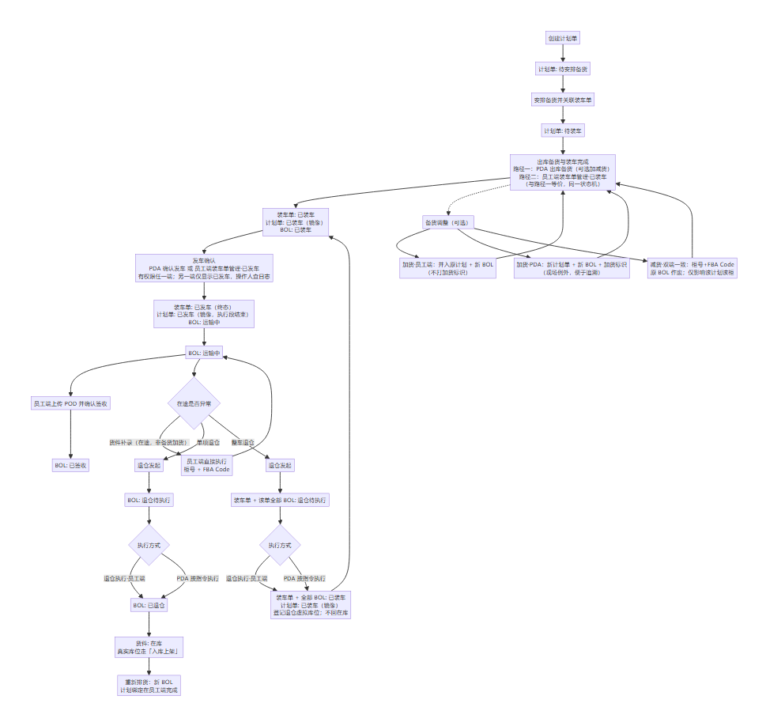

# FBA发货计划与派送管理 — 产品需求文档 (PRD)

## 1. 文档说明

明确 FBA 发货计划与派送执行的一体化业务规则，覆盖从计划创建到签收完结的全流程，并约束备货调整、补录、退仓等异常场景处理方式。

### 1.1 修订记录

| 版本号 | 修订日期 | 修订人 | 修订说明 |
|--------|----------|--------|----------|
| V1.0 | 2026-05-28 | — | 初稿 |

### 1.2 名词解释

| 专有名词 | 解释/定义 |
|----------|-----------|
| 计划单 | FBA 出库业务的计划主体；状态含待安排备货、待装车、**已装车**、**已发车**、已取消等；**严格跟随**关联装车单至已发车；发车后不再随 BOL 运输中/已签收变更，派送进度在 BOL 层查看 |
| 装车单 | 仓库执行与发车承载单据；状态链路为待装车 → 已装车 → **已发车**（已发车为装车单终态） |
| BOL | 装车执行与派送跟踪的业务单据；含**已装车**、运输中、已签收、**退仓待执行**、已退仓、已作废等；派送、POD、在途异常均在 BOL 层 |
| 安排备货 | 将计划单与装车单建立关联并确认备货范围，完成后计划单进入待装车 |
| POD | 签收凭证，按 BOL 维度上传与留存 |
| 调度备货加货 | 员工端（调度）在**备货阶段**向**原计划**并入货物：生成**新 BOL** 并绑定原计划，**不打**加货标识；业务上由调度跟进，非正常仓库随意加货 |
| 仓库备货加货 | PDA 在**备货阶段**现场加货：自动生成**新计划单** + **新 BOL**，BOL 打**加货标识**，便于追溯仓库侧例外加货 |
| 备货减货 | 员工端与 PDA **规则一致**：按**柜号 + FBA Code**；原 BOL **作废**；仅影响**该计划内该柜**货物，同计划其他柜、同装车单其他计划不受影响 |
| 货件补录 | **在途**按柜号 + FBA Code 补录遗漏货件，纳入当前装车单/BOL 派送流程（**非**备货加货）；**仅员工端直接执行**，不提供 PDA |
| 退仓发起 | 员工端对单项（按 BOL）或整车（按装车单）发起退仓指令；目标对象进入**退仓待执行**，由仓库在 PDA 或员工端**退仓执行**完成 |
| 退仓执行 | 员工端当场完成退仓（等同仓库已执行），或 PDA 按已发起指令执行；回写 BOL/货件/装车单状态并记日志 |
| 单项退仓 | 目标 BOL：退仓待执行 → **已退仓**；货件回归在库（真实库位走「入库上架」）；**不**解除计划单关联、**不**自动将计划单改为待安排备货 |
| 整车退仓 | 退仓发起：装车单及该单下**全部 BOL** → **退仓待执行**；执行后登记**退仓虚拟库位**（仅留痕），装车单及全部 BOL → **已装车**，关联计划单镜像为**已装车**；不执行在库恢复、入库上架、计划单取消或装车单作废 |
| 退仓虚拟库位 | 整车退仓执行时登记的留痕库位，**非**真实上架库位 |

---

## 2. 产品概述

### 2.1 产品背景

当前业务在计划、装车、发车、在途与签收环节存在跨角色、跨端协同，若规则不统一，容易出现状态不一致、异常处置口径不一致、追溯困难等问题。需要通过统一流程与**分层状态机**（计划单 / 装车单 / BOL / 货件），保证链路闭环。

### 2.2 目标用户

| 用户角色 | 特征与诉求 |
|----------|------------|
| 调度 | 计划加货、发车核对、在途补录与退仓发起/执行、签收与 BOL 状态跟进 |
| 仓库 | 出库备货、装车、发车（PDA）、按指令执行退仓 |
| 客服 | 过程可视、异常跟进与客户同步 |
| 管理员 | 权限配置、关键操作审计 |

### 2.3 产品目标

| 类型 | 目标说明 |
|------|----------|
| 定性 | 建立「先计划、后装车、再 BOL 派送签收」的统一链路 |
| 定量 | 关键节点有状态与日志留痕，支持全链路追溯 |

**本期不包含：**

- 计费规则与报价引擎  
- 报表统计口径输出  
- 验收标准与测试用例编写  

### 2.4 关联模块

| 关联模块 | 与本模块关系 |
|----------|--------------|
| FBA发货计划-计划单管理 | 计划创建、安排备货、调度备货加货/减货、计划与装车单关联 |
| FBA发货计划-装车单管理 | 已装车/已发车（与 PDA 备货、发车等价）；装车单状态止于已发车 |
| FBA派送管理 | 按 BOL 维度的在途、签收、POD、退仓发起/执行 |
| 货件管理 | 货件状态随 BOL/退仓/上架联动 |
| PDA | 出库备货（含仓库加货/减货）、确认发车、按指令执行退仓 |
| 财务 | 读取签收与退仓结果用于核对（本期不计费） |

---

## 3. 业务流程与架构

### 3.1 核心业务流程图

*图 3.1 — 先计划单，后装车单；计划单执行状态镜像至已发车；装车单至已发车为止；运输中与签收在 BOL 层*

1. 创建计划单 → 待安排备货 → 安排备货关联装车单 → 待装车。  
2. **出库备货与装车完成**（同一状态机，任一路径）：  
   - **路径一：** PDA 出库备货（可选加减货）后仓库装车完成；  
   - **路径二：** 员工端装车单管理确认**已装车**（与 PDA 出库备货+装车完成等价）。  
   结果：装车单 **已装车**，关联计划单 **已装车**（镜像），关联有效 BOL **已装车**。  
3. **发车：** PDA 确认发车或员工端装车单管理确认**已发车**；**有菜单权限的任一端**可提交；另一端仅显示已发车，是否已发车即可，操作人查日志。装车单 **已发车**（终态），计划单 **已发车**（镜像，计划执行段结束），关联 BOL **运输中**。  
4. 各 BOL **运输中** → 员工端上传 POD → **已签收**（不再变更计划单/装车单状态）。  
5. 在途：货件补录（仅员工端直接执行）、单项/整车退仓（退仓发起 → 退仓待执行 → 退仓执行）；规则见 §3.2、§4.3。  

### 3.2 状态归属（核心）

| 业务对象 | 主要状态 | 说明 |
|----------|----------|------|
| 计划单 | 待安排备货、待装车、**已装车**、**已发车**、已取消 | **严格跟随**关联装车单（至已发车）；减货剔光后回**待安排备货**并解除装车单关联；发车后**不**随 BOL 运输中/已签收变更；可维护 ISA、备注等跟进类字段，**不**改状态与货件绑定 |
| 装车单 | 待装车 → 已装车 → **已发车** | **无**运输中/已签收；部分 BOL 已退仓时装车单仍为已发车；已发车后不改状态，必要时仅信息修正并记日志 |
| BOL | **已装车**、运输中、已签收、**退仓待执行**、已退仓、已作废 等 | 装车完成时 **已装车**；发车后与装车单已发车同步为 **运输中**；派送、POD、在途异常均在 BOL 层 |
| 货件 | 在库、运输中等 | 单项退仓后在库；真实库位通过「入库上架」维护 |

| 动作 | 装车单 | 计划单 | BOL | 货件 |
|------|--------|--------|-----|------|
| 装车完成 | **已装车** | **已装车**（镜像） | **已装车** | — |
| 调度备货加货 | — | 并入**原计划** | **新 BOL**（无加货标识） | 纳入该计划 |
| 仓库备货加货 | — | **新计划单** | **新 BOL**（加货标识） | 纳入新计划 |
| 备货减货 | — | 剔货；剔光→待安排备货 | 目标 **已作废** | 从计划剔除 |
| 发车（任一端有权限） | **已发车** | **已发车**（镜像） | **运输中** | — |
| POD / 签收 | 不变 | 不变 | **已签收** | 随 BOL |
| 退仓发起·单项 | 不变 | 不变 | **退仓待执行** | — |
| 退仓发起·整车 | **退仓待执行** | 镜像待执行 | 该单全部 **退仓待执行** | — |
| 退仓执行·单项 | 仍已发车 | 不变 | **已退仓** | **在库**（上架另流程） |
| 退仓执行·整车 | **已装车** | **已装车**（镜像） | 该单全部 **已装车** | **不**自动在库恢复 |
| 在途货件补录 | 仍已发车 | 不变 | 纳入当前 BOL 流程 | 纳入派送 |

**列表与作业口径：** 作业列表默认只展示**有效 BOL**（排除已退仓、已作废）；退仓待执行可在列表展示以便对单。详情可查看历史 BOL。重新排货须使用**新 BOL 号**，不得复用已退仓/已作废 BOL。

---

## 4. 需求详细说明

### 4.1 产品方案概述

1. 以计划单为起点，装车单承载装车与发车，BOL 承载在途与签收。  
2. 备货阶段处理加货/减货；在途阶段处理补录/退仓，二者不可混用。  
3. 关键动作按**菜单权限**开放端（员工端 / PDA），不按是否上线 PDA 拆两套流程；同一状态机；关键操作记**操作人、端类型、时间**。  

### 4.2 核心功能一览

#### 4.2.1 四大核心能力

| 序号 | 核心能力 | 解决什么问题 | 关键功能点（P0） |
|:----:|----------|--------------|------------------|
| ① | 计划先行 | 先有计划再执行 | 创建计划、安排备货、关联装车单 |
| ② | 装车发车 | 装车单状态闭环 | 已装车、已发车；员工端与 PDA 等价；任一端有权限可发车 |
| ③ | BOL 派送签收 | 在途与凭证 | BOL 运输中、POD、已签收 |
| ④ | 异常可控 | 备货与在途异常 | 双口径加货、统一减货、补录、退仓发起/执行 |

#### 4.2.2 核心功能点索引

| 核心功能点 | 说明摘要 | 详述章节 |
|------------|----------|----------|
| 计划单与备货 | 计划、调度/PDA 加货、减货 | 4.3.1 |
| 装车与发车 | 装车单至已发车 | 4.3.2 |
| 签收与 POD | 按 BOL | 4.3.3 |
| 在途异常 | 补录、退仓发起/执行 | 4.3.4 |
| 跨端协同 | 员工端 / PDA / 财务读取 | 4.3.5 |

### 4.3 具体功能详述

#### 4.3.1 【计划单】创建、备货与加减货

- **使用场景：** 创建计划并安排至装车前；备货阶段由调度（员工端）或仓库（PDA）调整实装范围。  
- **前置条件：** 具备计划或备货相关权限；装车单未发车。  
- **操作流程：**
  1. 创建计划单，状态为待安排备货。  
  2. 选择装车单完成安排备货，计划单进入待装车。  
  3. 路径一：PDA 出库备货，按需仓库加货或减货，确认备货/装车完成。  
  4. 路径二：员工端装车单管理确认已装车（与路径一等价）。  
  5. 装车单、计划单进入已装车；关联 BOL 为已装车。  
- **业务规则（核心）：**
  - 仅待安排备货可安排备货；须关联有效装车单。  
  - **调度备货加货（员工端）：** 向**原计划**并入货物，生成**新 BOL** 并绑定原计划，**不打**加货标识；须关联当前备货上下文装车单。  
  - **仓库备货加货（PDA）：** 不选择原计划；自动生成**新计划单** + **新 BOL**，BOL 打**加货标识**；业务上正常不允许仓库随意加货，本规则用于现场例外追溯。  
  - **备货减货（双端一致）：** 按**柜号 + FBA Code**；原 BOL **作废**；仅影响**该计划内该柜**；同计划其他柜、同装车单其他计划不受影响。  
  - **减货后计划单无货：** 计划单自动变为**待安排备货**，并**解除与当前装车单关联**；员工端可人工将计划标为**已取消**（须填原因）。  
  - **减货后计划单仍有其他 BOL/货件：** 计划单保持**待装车**（或随装车单已进入已装车前的相应状态），仅作废对应 BOL。  
- **异常处理：** 未选装车单、状态不符、装车单已发车时阻断；减货范围为空时阻断。  

#### 4.3.1.1 【计划单】修改计划（计划头字段）

- **使用场景：** 调度/客服在计划执行过程中维护计划头信息（如发车时间、ISA、预计送达等）。  
- **前置条件：** 具备计划单编辑权限；已取消的计划不可修改。  
- **操作口径：**
  1. 「修改计划」仅修改**计划头字段**；计划明细（柜/货件）调整仍通过明细区的智能排货/移出计划完成。  
  2. 发车后派送状态仅在 BOL 层更新；计划单可用于跟进信息维护，但不得再调整明细。  
- **字段与状态规则（核心）：**
  - **待安排备货：** 计划头字段可编辑；明细可调整；若变更 **FBA Code** 且计划下已有绑定明细，需二次确认并清空计划明细。  
  - **待装车 / 已装车：** 计划头字段可编辑，但 **FBA Code 不可修改**；计划车型可修改；明细可调整。  
  - **已发车：** 仅允许修改 **ISA、预计送达时间、ISA供应商、变更凭证、ISA变更原因、备注**；明细不可再调整（智能排货/移出计划禁用）。  
  - **已取消：** 不可修改。  

- **变更凭证（附件）：**
  - 新增与修改均采用**单文件上传**方式。  
  - 支持格式：ZIP、PDF、JPG/JPEG、PNG、DOC/DOCX、XLS/XLSX 等常规格式。  
  - 建议大小：不超过 10MB。  

#### 4.3.2 【装车单】装车与发车

- **使用场景：** 仓库完成装车；发车确认。  
- **前置条件：** 计划单已关联装车单且处于备货/待装车或已装车流程中。  
- **操作流程：**
  1. 确认装车完成：PDA 出库备货链路完成，或员工端装车单管理点击**已装车** → 装车单、关联计划单 **已装车**；关联 BOL **已装车**。  
  2. **发车确认：** PDA 确认发车或员工端装车单管理**已发车**；具备对应菜单权限的**任一端**均可提交。  
  3. 装车单 → **已发车**；关联计划单 → **已发车**（镜像）；关联 BOL → **运输中**。  
- **业务规则（核心）：**
  - 仅**已装车**可发车。  
  - 发车必填项（如发车时间、发车类型等）以原型/装车单管理为准；备货仓与装车单绑定后不可改。  
  - 装车单状态**止于已发车**；计划单**止于已发车（执行镜像）**；后续运输中/已签收**仅**变更 BOL。  
  - 任一端发车成功后，另一端仅展示已发车；操作人、端类型查**操作日志**。  
- **异常处理：** 必填缺失、状态非法时阻断；重复发车须阻断并记日志。  

#### 4.3.2.1 【装车单】修改装车单

- **使用场景：** 调度/客服对装车单主信息进行维护与修正。  
- **前置条件：** 具备装车单编辑权限；装车单存在且非已取消。  
- **操作口径：**
  1. 「修改装车单」仅修改装车单主信息，不在该弹窗内调整计划明细。  
  2. 计划明细增减继续通过明细区「添加计划 / 移出计划」操作。  
  3. 装车单已发车后，明细区调整入口禁用。  
- **字段与状态规则（核心）：**
  - **待装车 / 已装车：** 可编辑发车类型、预计发车时间、运输车型、送仓顺序、月台、派送供应商、实际承运卡司、卡司提货时间、车牌号、装车备注、发车备注。  
  - **只读字段：** 装车单号、备货仓、FBA Code。  
  - **已发车：** 仅允许修正发车跟进信息（实际承运卡司、卡司提货时间、车牌号、发车备注），不影响状态流转。  
  - **已取消：** 不可修改。  
- **异常处理：** 状态不允许时阻断并提示；保存后更新修改人/修改时间并记操作日志。  

#### 4.3.3 【BOL】签收与 POD

- **使用场景：** BOL 运输中上传签收凭证。  
- **前置条件：** 目标 BOL 为**运输中**（装车单已为已发车）。  
- **操作流程：**
  1. 在 FBA 派送管理（按 BOL 维度）选择运输中记录。  
  2. 填写签收时间并上传 POD。  
  3. 目标 BOL → **已签收**。  
- **业务规则（核心）：**
  - 运输中可上传 POD；已签收可修改 POD（规则以原型为准）。  
  - **退仓待执行、已退仓、已作废**等终态或待执行 BOL 不可上传 POD。  
  - 签收与 POD 绑定 **BOL**，不提升装车单、计划单状态。  
- **异常处理：** 缺附件/签收时间、状态不符时阻断。  

#### 4.3.4 【在途】补录与退仓

- **使用场景：** 运输中遗漏、退仓等异常。  
- **前置条件：** 装车单已发车；目标 BOL 为运输中（补录/单项退仓）或符合整车退仓条件。  
- **操作流程：**
  1. **货件补录：** 员工端选择对象并填写原因，**直接执行**（无 PDA、无退仓发起步骤）。  
  2. **单项/整车退仓：** 员工端选择**退仓发起**或**退仓执行**：  
     - **退仓发起：** 生成待执行指令；单项 → 目标 BOL **退仓待执行**；整车 → 装车单及该单下**全部 BOL** **退仓待执行**。  
     - **退仓执行：** 员工端当场完成，或 PDA 按已发起指令执行。  
  3. 系统按类型更新 BOL/货件/装车单/计划单状态并写日志。  
- **业务规则（核心）：**

| 类型 | 发起 | 执行 | 结果 |
|------|------|------|------|
| 货件补录 | — | 仅员工端 | 按柜号+FBA Code 纳入**当前**装车单/BOL 流程；**非**备货加货 |
| 单项退仓 | 员工端·退仓发起 | 员工端·退仓执行 或 PDA | 目标 BOL → **已退仓**；货件 → **在库**；计划单**不**回待安排备货 |
| 整车退仓 | 员工端·退仓发起 | 员工端·退仓执行 或 PDA | 发起：装车单+全部 BOL → **退仓待执行**；执行：登记**退仓虚拟库位**；装车单+全部 BOL → **已装车**；计划单镜像 **已装车**；不回在库 |

- **重新排货（单项退仓后）：** 须生成**新 BOL**；**员工端**将新 BOL 绑定至原计划单（新增 BOL 行）或新建计划单。  
- **列表过滤：** 作业列表默认不展示已退仓/已作废 BOL；**退仓待执行**可展示；历史 BOL 在详情/日志中可查。  
- **异常处理：** 未选对象、未填原因、重复退仓时阻断；整车退仓须二次确认。  

#### 4.3.5 【跨端协同】

- **员工端：** 计划与装车单管理（已装车/已发车与 PDA 等价）、调度备货加货/减货、发车确认（有权限时）、在途补录（直接执行）、退仓发起/退仓执行、POD、重新排货时 BOL 与计划单绑定。  
- **PDA：** 出库备货（仓库加货/减货）、确认发车、按指令执行退仓（含整车退仓虚拟库位）；**不提供**在途货件补录。  
- **财务：** 读取签收与退仓结果；已退仓/已作废 BOL 是否进入结算由后续计费模块定义（本期不计费）。  
- **一致性：** 以分层状态为准；关键操作记操作人、**端类型**、时间；延迟回传按时间顺序校正。  

---

## 5. 界面与交互需求

界面以现有原型为准；本节仅列与业务相关的要点。

### 5.1 页面布局规范

- 计划单管理、装车单管理、FBA 派送管理分阶段展示。  
- 计划单列表可展示至**已发车**（执行镜像）；**不**以计划单 Tab 表达 BOL 运输中/已签收。  
- FBA 派送管理列表 Tab（运输中/已签收等）语义为 **BOL 层**。  
- 详情区分当前有效 BOL 与历史 BOL（已退仓/已作废）；退仓待执行可对单展示。  

### 5.2 交互反馈

| 场景 | 交互要求 |
|------|----------|
| 未选择单据 | 阻断并提示 |
| 状态不允许的操作 | 提示当前 BOL/装车单/计划单状态 |
| 退仓类操作 | 二次确认及影响说明；区分退仓发起与退仓执行 |
| 重复发车 | 阻断并记日志 |

### 5.3 功能界面截图

- 本期以现有原型为准，截图按需补充。  
- 业务规则以 §3.2、§4.3 为准。  

---

## 6. 非功能性需求

### 6.1 性能需求

- 常规查询与状态变更满足日常作业时效。  

### 6.2 安全需求

- 按菜单权限控制操作；高风险操作审计留痕。  

### 6.3 兼容性需求

- PC 员工端主流浏览器；PDA 协同。  

---

## 7. 数据统计与埋点需求

### 7.1 业务数据监控

### 7.2 埋点需求清单

---

## 8. 上线与运维计划

- **数据初始化：** 计划单、装车单、BOL 状态字典（含退仓待执行）及权限配置。  
- **培训与支持：** 强调装车单/BOL 分层、计划镜像至已发车、调度加货与仓库加货差异、退仓发起/执行、员工端与 PDA 等价备货发车。  
- **回滚策略：** 保留已执行数据追溯。  
