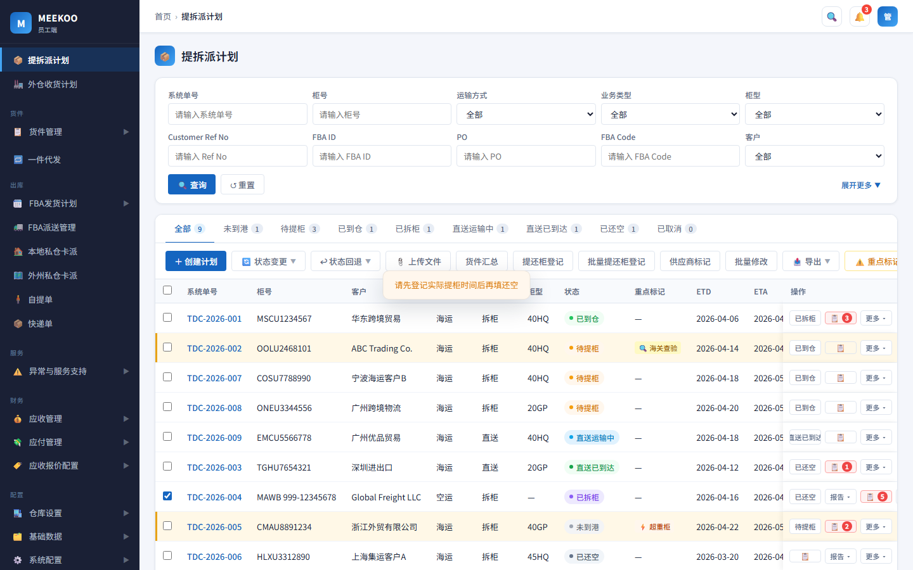
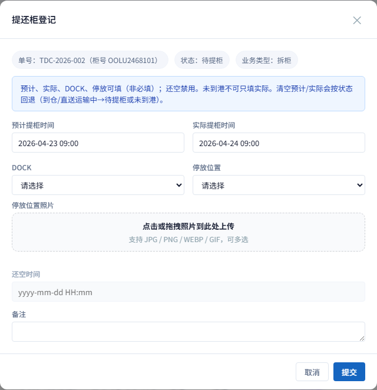
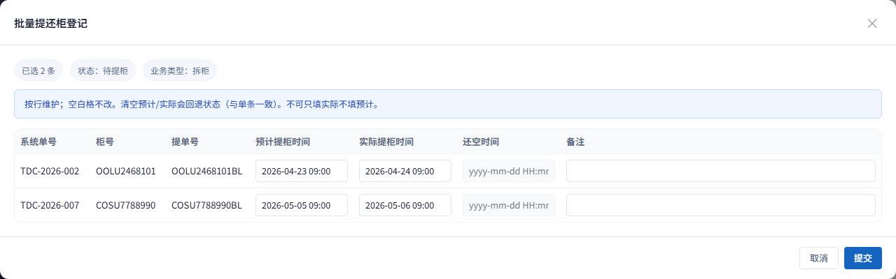
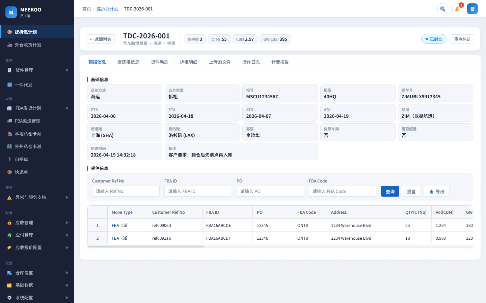
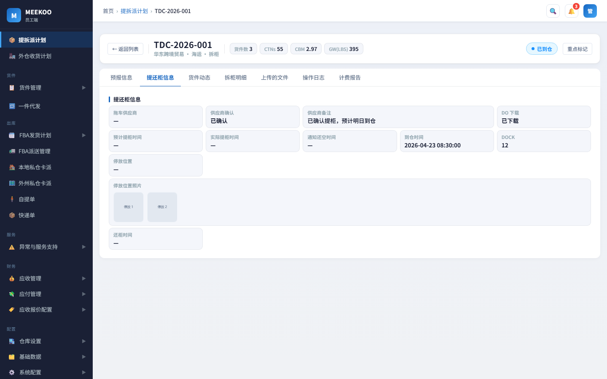

# 提拆派 · 提还柜登记 / 批量 / 供应商标记 / 已到仓停放 / 详情

页面：员工端「提拆派计划」。按钮权限另配。

截图目录：`admin/docs/images/pickup-vendor/`（原型演示数据）。

---

## 1. 提还柜登记（单条）

### 交互

- 勾选 **1 条** →「提还柜登记」（多条请用「批量提还柜登记」）
- **已取消** 不可进
- 弹窗字段：预计提柜、实际提柜、还空、DOCK、停放位置、停放位置照片、备注（可用性见下表）
- 打开时：若计划上 **已有** 预计 / 实际 / 还空 / 停放 / 备注，须 **带出展示**（只读字段同样带出）

### 状态流转

| 条件 | 结果 |
|------|------|
| 未到港 + 提交预计提柜 | → 待提柜 |
| 清空预计后无预计 | → 未到港；**并清空**实际提柜时间、DOCK、停放位置及照片 |
| 已到仓 / 直送运输中 + 清空实际（仍有预计） | → 待提柜 |
| 已到仓 / 直送运输中 + 清空预计 | → 未到港（同上，连带清空实际与停放） |
| 已拆柜 / 直送已到达 + 提交还空 | → 已还空 |

说明：

- 实际提柜 **只记时间，不推状态**
- 清空预计 / 实际的回退节点与「状态回退」可选目标对齐

### 按状态约束

| 状态 | 可填字段 | 规则 |
|------|----------|------|
| 未到港 / 待提柜 | 预计、实际、DOCK、停放、照片、备注 | 均非必填；还空禁用；**禁止只填实际不填预计** |
| 已到仓 / 直送运输中 | 同上 | 均非必填；还空禁用；**允许清空**预计 / 实际并按上表回退 |
| 已拆柜 / 直送已到达 | **仅还空** | 其它只读（仍带出已有预计 / 实际 / 停放）；须 **已有实际提柜**；提交后 → 已还空 |
| 已还空 | **仅还空** | 只可改正，**不可清空**；其它只读并带出 |
| 已取消 | — | 不可操作 |

### 其它校验

- 实际 ≥ 预计；还空 ≥ 实际
- 单条：输入框清空后提交 = 清空该字段（受上表限制）
- 标记已到仓 **不强制** 已有实际提柜时间

---

## 2. 批量提还柜登记

### 交互

- 勾选 ≥1 条，且 **状态相同、业务类型相同** →「批量提还柜登记」
- **已取消** 不可进
- 表格按行：系统单号、柜号、提单号、预计提柜、实际提柜、还空、备注
- **无停放**（DOCK / 停放 / 照片只走单条）
- 各时间列表头下方：统一填写输入框 +「应用到全部」（按当前状态可用性启用；填入后各行仍可改）

### 带出已有时间（重要）

- 打开弹窗时，**每一行**须带出该柜在列表上已有的：
  - 预计提柜时间
  - 实际提柜时间
  - 还空时间
  - 备注（有则带出）
- 仅日期无时刻时，可默认补 `09:00` 展示
- 无值则空框；只读列（如已拆柜时的预计 / 实际）同样带出，不可改
- 「表头统一填写」：若所选行某一时间 **全部相同**，可预填该值；不一致则留空，避免误覆盖

### 逻辑

- 时间与状态规则 **同单条**（含清空回退、已还空只改正、填还空须有实际提柜、禁止只填实际）
- 预填值删空后提交 = 清空；未改动的格子保持原值（以打开时带出值为基准）

---

## 3. 供应商标记

### 交互

- 列表「供应商确认」列只展示（如 `已确认数据, 已下载DO` 或 `—`），不可点
- 勾选 →「供应商标记」→ 选类型 → 确认标记 / 清除标记（弹窗有标题、关闭）

### 逻辑

- 类型：已确认数据、已下载 DO；一次只打 / 清一种
- 查询「供应商标记」为 **同一表单项下左右两个下拉**：
  - 左：**有 / 无**（也可留「全部」）
  - 右：**标记字段**（已确认数据 / 已下载 DO）
  - 有无 + 标记都选后才过滤（例：有 + 已确认数据；无 + 已下载 DO）

---

## 4. 状态变更 → 已到仓（带停放只读）

### 交互

待提柜 → 已到仓时，状态变更弹窗字段顺序：

1. **停放位置**（只读：DOCK / 停放位置 / 照片；缺省显示「—」）
2. **实际提柜时间**（非必填，在到仓时间左侧）
3. **到仓时间**（必填）
4. **备注**

### 逻辑

- 停放来自「提还柜登记」已填内容，本弹窗 **只读**
- 缺省统一用「—」展示，**不挡** 标记已到仓
- **到仓时间必填**；**实际提柜时间非必填**（不强制已有实际提柜）
- 行内「状态变更 → 已还空」与提还柜登记填还空 **两条入口都保留**

---

## 5. 计划详情

### Tab 划分

| Tab | 内容 |
|-----|------|
| 预报信息 | 仅客户下单内容（运输 / 柜 / 提单 / ETD·ETA 等 + 货件信息），不含执行侧字段 |
| 提还柜信息 | 执行过程字段（独立 Tab，勿塞进「拆柜明细」） |
| 其它 | 货件动态、拆柜明细、上传的文件、操作日志、计费报告（既有） |

### 提还柜信息（只读）

| 字段 | 说明 |
|------|------|
| 拖车供应商 / 供应商确认 / 供应商备注 | 确认：已确认 / 未确认；备注有则显示 |
| DO 下载 | 仅「已下载」/「未下载」（不展示时间） |
| 预计提柜、实际提柜、到仓、还柜时间 | 与列表一致 |
| 通知还空时间 | 与「还空时间」**不是同一字段**（本需求不展开） |
| DOCK / 停放位置 / 停放位置照片 | 无则 —；照片可点看大图 |

详情不提供打标弹窗；改标记走工具栏「供应商标记」，改停放 / 时间走提还柜登记。
