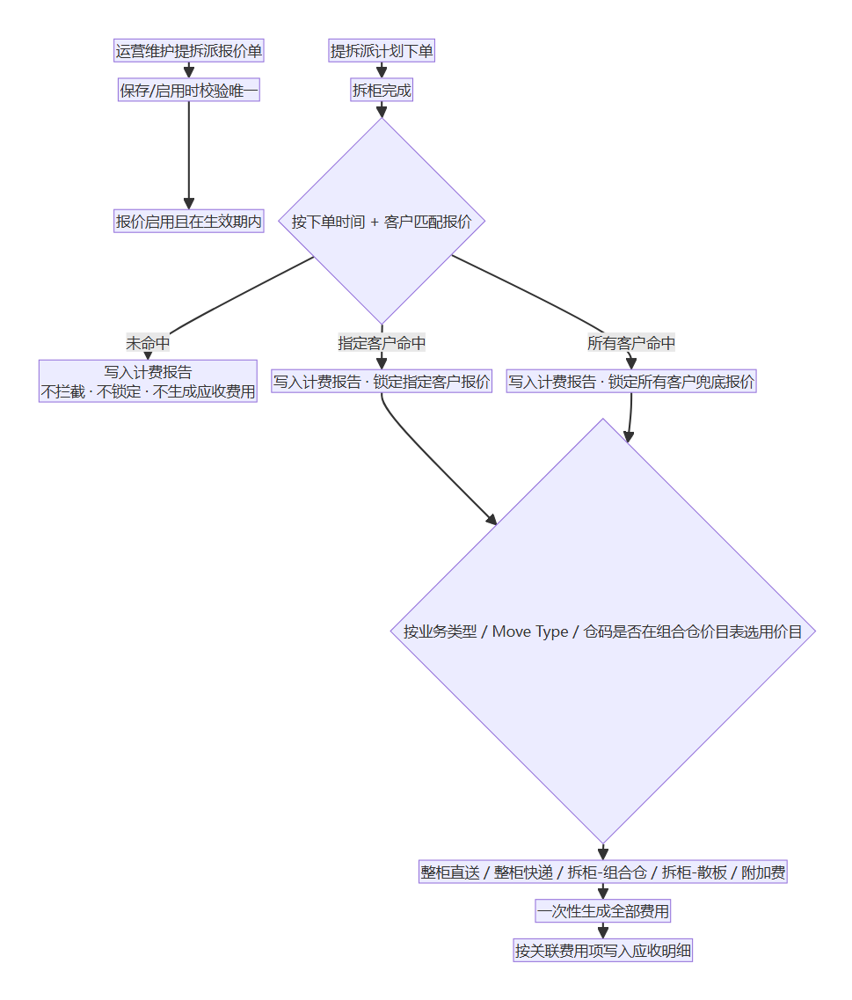
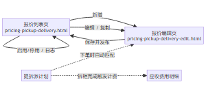
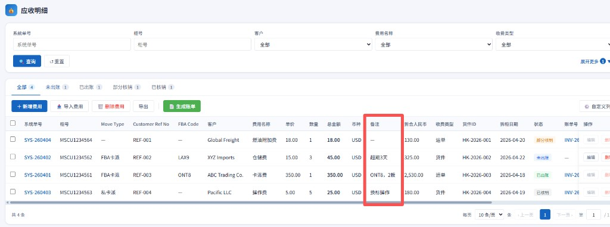
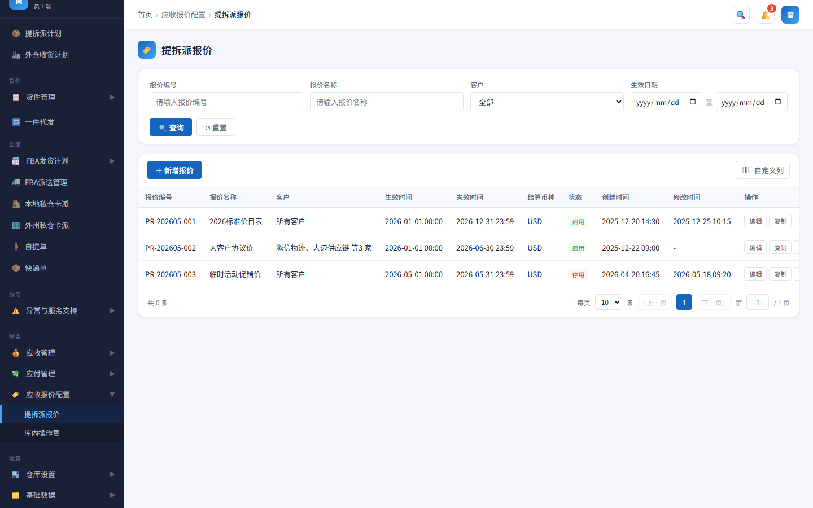
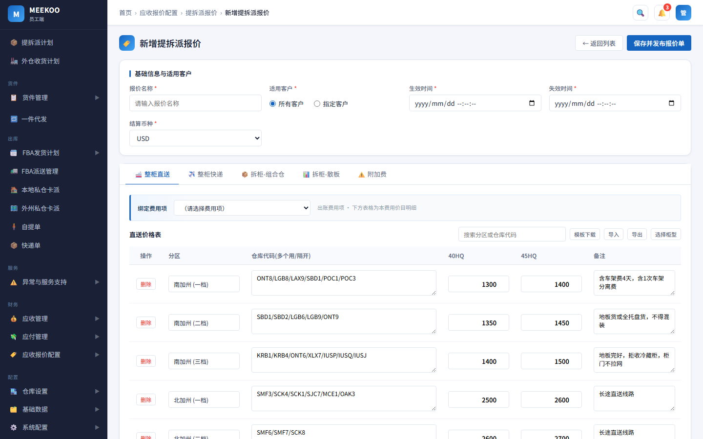
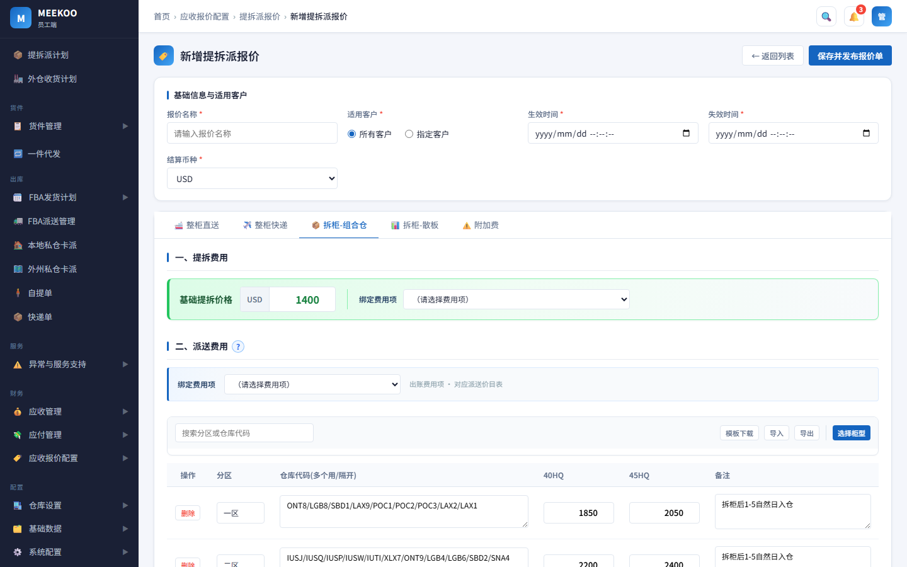
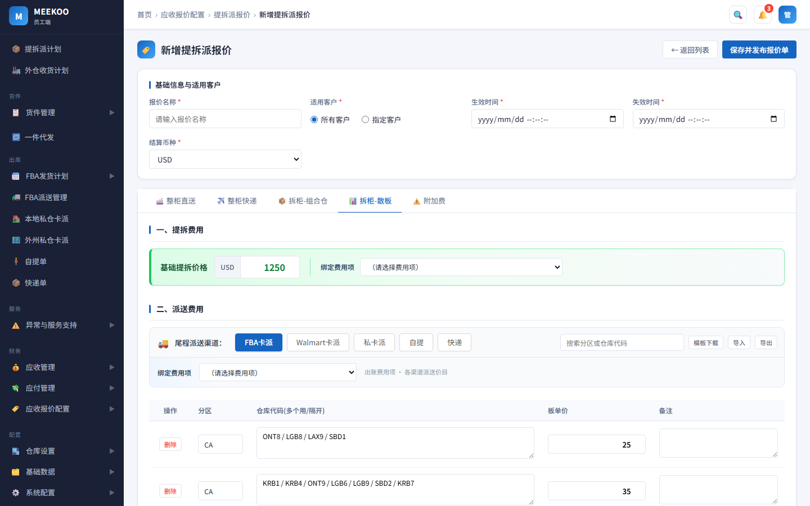

# 提拆派报价 — 产品需求文档 (PRD)

## 1. 文档说明

明确 MEEKOO 员工端「**提拆派报价**」的价目维护、客户报价匹配、价目自动选用规则及拆柜后应收费用一次性生成逻辑。

### 1.1 修订记录

| 版本号 | 修订日期 | 修订人 | 修订说明 |
|--------|----------|--------|----------|
| V1.0 | 2026-05-25 | — | 初稿 |

### 1.2 名词解释

| 专有名词 | 解释/定义 |
|----------|-----------|
| 启用 / 停用 | 列表「状态」仅此两种；匹配与否见 **3.1**、**4.2.2** |
| 生效 / 失效时间 | 价目有效期（**非**列表状态）；用于拆柜完成时是否可匹配 |
| 未生效（可编辑） | 当前时间 **< 生效时间**；可编辑原单 |
| 已生效（不可改原单） | 当前时间 **≥ 生效时间**；原单只读，调价须**复制**新报价 |
| Move Type | 提拆派计划**货件明细**中的派送/渠道类型（如 FBA卡派、UPS） |
| 关联应收费用项 | 各价目绑定位在编辑页**自行选择**的应收费用项（**无系统默认**）；出账按所选费用项拆分费用行 |
| 分区 | 价目表分区字段；组合仓各货件按**所属分区**取对应全包价参与分摊 |
| 组合仓 | 多 FBA 仓拼柜；仓码须纳入本报价「拆柜-组合仓」派送价目表；**允许跨区**；全包价减基础提拆价后按方数分摊 |
| 散板 | 按板或尾程渠道计价；FBA/Walmart 卡派且仓码**未纳入**组合仓派送价目表时**改按散板** |

---

## 2. 产品概述

### 2.1 产品背景

在 MEEKOO 员工端「应收报价配置」下，需维护**提拆派应收价目**。运营配置完成后，系统在**拆柜完成**时自动匹配报价（命中则锁定），并一次性生成应收费用明细。

### 2.2 目标用户

| 用户角色 | 特征与诉求 |
|----------|------------|
| 运营 / 商务 | 维护客户价目、控制生效周期、复制历史报价 |
| 财务 / 应收 | 确保拆柜后费用按关联费用项正确拆分、币种一致 |
| 系统管理员 | 配置费用项关联、查看操作日志 |

### 2.3 关联模块

| 关联模块 | 与本模块关系 |
|----------|--------------|
| 提拆派计划 | **拆柜完成时**匹配报价，**匹配结果均写入提拆派计划-计费报告**；**命中则锁定并出账**；**未命中**不拦截、不锁定、不生成应收费用 |
| 基础数据-费用项配置 | 维护各价目可关联的应收费用项；出账费用行按关联费用项拆分 |
| 币种管理 | 维护系统可用结算币种；报价编辑页下拉选项与此一致 |
| 应收出账 | 拆柜后生成的费用明细写入应收侧，供对账与结算 |

---

## 3. 业务流程与架构

### 3.1 核心业务流程与报价匹配

*图 3.1 — 报价维护、拆柜完成匹配、价目选用、计费并写入应收*

**报价匹配（拆柜完成时触发）：** 在**拆柜完成**节点执行匹配；取计划**下单时间**与客户，在**启用**且 **生效时间 ≤ 下单时间 ≤ 失效时间**的报价中选用。② **指定客户**优先，否则**所有客户**；③ 至多命中 1 条（**配置期唯一性**见 **4.2.2**）；④ **匹配结果（命中或未命中）均写入提拆派计划-计费报告**（含锁定报价、未命中原因等）；**未命中**时不拦截流程、不锁定、不生成应收费用。

**锁定：** 命中则在拆柜完成时锁定报价并出账；未命中不锁定、不出账、不拦截。已锁定计划不受后续停用/调价/再启用影响（**4.2.8**）。

### 3.2 页面流转图

*图 3.2 — 列表 ↔ 编辑；拆柜完成匹配报价并出账*

---

## 4. 需求详细说明

### 4.1 核心能力与章节索引

| 序号 | 能力 | P0 要点 | 详述 |
|:----:|------|---------|------|
| ① | 价目维护 | 五类价目 + 附加费；生效前改原单；生效后仅**复制**调价；CSV 导入导出 | 4.2.1～4.2.4、4.2.9 |
| ② | 报价匹配 | 拆柜完成时；启用 + 时间窗；指定客户优先；配置期唯一 | **3.1**、4.2.2 |
| ③ | 价目自动选用 | 匹配成功后按业务类型、Move Type 选价目；FBA/Walmart 仅当仓码**不在**组合仓派送价目表时**改按散板**（**允许跨区**） | 4.2.5 |
| ④ | 拆柜出账 | 拆柜完成时匹配并一次出账；按关联费用项写应收 | 4.2.6～4.2.8 |

其他：复制报价、操作日志（列表「更多」）。

### 4.2 功能详述

#### 4.2.1 报价列表

路径：应收报价配置 → 提拆派报价。查询：报价编号、名称、客户、生效日期范围。

列表列：编号、名称、客户（全部/指定摘要）、生效/失效时间、币种、状态（启用/停用）、创建/修改时间。

| 操作 | 说明 |
|------|------|
| 新增 | 进入编辑页 |
| 编辑 | 进入编辑页；能否修改原单见 **4.2.2** |
| 复制 | 按原单生成新编号报价单；调价流程见 **4.2.2** |

**说明（正式实现）：** 复制须带入原单**基础信息、五类价目及附加费规则**，可改后保存并发布。**HTML 原型**仅将单头（名称、客户、时间、币种、启停等）存入浏览器本地存储，价目与附加费为页面内置演示数据，「复制」时仅复制单头并在名称后加「（副本）」；正式系统须将价目与单头一并持久化。
| 启用 / 停用 | 切换是否参与拆柜完成时的报价匹配；见 **4.2.2** |
| 日志 | 「更多」查看操作记录 |

#### 4.2.2 报价单规则

**时间与编辑、调价**

| 当前时间与生效时间 | 能否改原单 | 调价方式 |
|--------------------|------------|----------|
| 未到生效时间 | 可 | 直接改原单并保存并发布（**不自动启用**） |
| 已到生效时间 | **不可** | 列表「复制」→ 改新单 → 保存并发布 →（建议）停用旧单 → 启用新单 |

- 能否改原单**仅看生效时间**，与列表启用/停用无关（术语见 **§1.2**）。
- 已到生效时间的原单若尝试保存：**必拦**，提示通过「复制」调价。
- 「复制」生成新报价单（系统分配新编号），**原报价单不变**；新单默认**停用**，启用前须通过配置期唯一性校验。

**配置期唯一性**

保存并发布、启用时校验：仅与**启用**状态的其它报价比对；本单为**停用**时保存不冲突。

| 适用客户 | 唯一规则 |
|----------|----------|
| 所有客户 | 不得有另一张**启用**的「所有客户」报价，生效～失效**有交集** |
| 指定客户 | 不得有另一张**启用**的「指定客户」报价，客户**有重复**且时间段**有交集** |
| 指定 vs 全部 | 可共存；拆柜完成时**指定客户优先**（**3.1**） |

时间段重叠：有交集即冲突；一方**失效时间 = 另一方生效时间**不算重叠。冲突**必拦**并提示重叠报价及范围。

**启停与匹配**

| 列表状态 | 后续拆柜完成能否匹配本报价 |
|----------|--------------------------|
| 启用 | 可以（还须满足计划下单时间在生效～失效时间窗内，见 **3.1**） |
| 停用 | 不可以 |

启停只影响**之后**拆柜完成的匹配；**不改变**已锁定报价的计划（**4.2.8**）。

#### 4.2.3 报价编辑 — 基础信息

| 配置项 | 必填 | 说明 |
|--------|------|------|
| 报价名称 | 是 | |
| 适用客户 | 是 | 所有客户 / 指定客户（≥1，不支持客户组） |
| 生效 / 失效时间 | 是 | 精确到秒；失效 ≥ 生效 |
| 结算币种 | 是 | **默认值：新建报价为 USD**（复制新单沿用原单币种，可改）。**选项来源：**「币种管理」中已启用币种。保存后，本报价价目与拆柜出账均按所选币种计价 |

字段校验见 **4.2.9**；配置期唯一性见 **4.2.2**；价目与费用项绑定见 **4.2.4**。

#### 4.2.4 报价编辑 — 价目

**关联应收费用项**

各价目 Tab 顶部提供「绑定费用项」下拉，选项来自「基础数据-费用项配置」。**新建**时均为空；**复制**新单时沿用原单所选，可修改；系统不设默认。拆柜完成后出账按本报价已选费用项写入应收。

**五类价目 Tab**

| 价目 Tab | 维护内容 | 需绑定的费用项（各选一） |
|----------|----------|--------------------------|
| 整柜直送 | 分区、仓码、柜型价、备注；支持 CSV 导入导出 | 直送运费 |
| 整柜快递 | 按柜型维护价目表 | 快递运费 |
| 拆柜-组合仓 | ①「一、提拆费用」基础提拆价 ②「二、派送费用」分区派送价目（全包价等）；支持 CSV | 提拆费、派送费 |
| 拆柜-散板 | ①「一、提拆费用」基础提拆价 ②「二、派送费用」各渠道子价目（FBA/Walmart、自提/快递、私卡派等；自提/快递为板单价）；支持 CSV | 提拆费、派送费 |
| 附加费 | 附加费规则列表 + 弹窗编辑（见下）；每条规则选费用名称与规则类型 | 正式：每条规则绑定 1 个费用项（**HTML 原型**暂未展示绑定下拉） |

**附加费规则维护（Tab「附加费」）**

- **列表：** 费用名称、规则摘要、计费摘要；操作「编辑」「删除」；「+ 新增行」新增规则并打开编辑弹窗。
- **编辑弹窗 — 基本信息：** 费用名称（下拉，见 **4.2.7**）、规则类型、备注。
- **规则类型 = 超出按量加收：** 触发条件（计费维度、大于阈值）、计费配置（超出部分单价，如 USD/箱）。
- **规则类型 = 触发后固定加收：** 计费配置（固定加收金额）。
- **规则类型 = 重量阶梯（如提柜超重）：** 阶梯表 — 柜型（**可多选**下拉）、柜重&gt;(LBS)、加收（固定加收）、金额($)、备注；「+ 新增阶梯」。区块说明：柜型命中且预报总柜重超过下限；多档命中时取柜重下限最高一档。匹配与演算见 **4.2.7**。
- **费用项绑定：** 正式实现须**每条规则**各绑定 1 个「关联费用项」，出账时写入应收。**HTML 原型**当前仅维护规则与演示数据，未展示 per-rule 绑定控件。

**拆柜提拆费说明**

- 组合仓、散板分别在各自 Tab「一、提拆费用」维护**一个**基础提拆价，并各绑定 1 个提拆费费用项。
- 出账时**整柜仅生成 1 条提拆费**；散板不因 FBA / Walmart / 私卡派 / 自提 / 快递等渠道或货件行数重复生成（界面见图 5.6）。
- 派送费按各 Tab「二、派送费用」及 **4.2.6** 分别计算；本柜同时存在组合仓与散板货件时，取哪套基础提拆价见 **4.2.5**。

直送、组合仓、散板价目表支持 CSV 导入；分区/代码/价格格式错误时行级提示。

#### 4.2.5 价目自动选用

输入：**业务类型为直送**时取计划基础信息中的**目的仓** + **柜型**（**无货件明细**）；**业务类型为拆柜**时取货件明细 **Move Type**、FBA Code、分区。输出：价目类型及价目行（运营不在报价页手工选类型）。

| 业务类型 | Move Type（货件明细） | 仓码在组合仓派送价目表 | 价目类型 | 匹配数据来源 |
|----------|----------------------|:----------------------:|----------|--------------|
| 直送 | — | — | 整柜直送 | 计划基础信息中的**目的仓** + 柜型 |
| 拆柜 | UPS / FEDEX / DHL / USPS | — | 整柜快递 | 货件明细 + 柜型 |
| 拆柜 | FBA卡派 / Walmart卡派 | 是 | 拆柜-组合仓 | 货件明细 |
| 拆柜 | FBA卡派 / Walmart卡派 | 否 | 拆柜-散板（**表外仓码，改按散板**） | 货件明细 |
| 拆柜 | 私卡派 / 自提 / 快递等 | — | 拆柜-散板 | 货件明细 |

**组合仓与跨区：** 锁定报价「拆柜-组合仓」派送价目表中，任一分区行的**仓库代码**（含 `/` 分隔的多码）视为已纳入组合仓。按货件 **FBA Code** 判断：**已纳入** → 该货件按组合仓计价（**允许本柜货件跨不同分区**，各货件按所属分区取对应全包价参与方数分摊）；**未纳入** → 该货件**改按拆柜-散板**取价，**不因缺组合仓价目拦截**出账。

**拆柜提拆费（整柜一次）：** 本柜 FBA/Walmart 货件仓码**均在**组合仓派送价目表内时，取组合仓「基础提拆价格」；若存在任一表外仓码货件，取散板「基础提拆价格」。

#### 4.2.6 计费规则

价目选用见 **4.2.5**。拆柜出账按下列规则计算（演算币种 USD，出账 = 报价结算币种）。**§4～§6（散板）**均为 **① 提拆费 + ② 派送费** 两部分：① 整柜只计一次（见 **4.2.4**）；② 按各渠道价目分别计算。

| 编号 | 内容 | 计算规则 |
|:----:|------|----------|
| §1 | 整柜直送 | 按计划**目的仓**（价目表仓码）+ **柜型**命中直送价目表一行，取该列**价格**，**整柜一口价** |
| §2 | 整柜快递 | 按**柜型**命中整柜快递价目表一行，取该柜型**价格**，**整柜一口价** |
| §3 | 拆柜-组合仓（含超重） | **① 提拆费** = 组合仓「基础提拆价格」（整柜计一次）。**② 派送费**（已纳入该分区组合派送价目表的仓码）：分摊 = (分区全包价 − 基础提拆价) × (该货件方数 ÷ **全柜计费方数**)。**超重派送附加**（仅上述组合仓码）：超重系数 = 重量 ÷ 体积 ÷ **500**；**仅当超重系数 ≥ 1** 时，分摊 × 系数，否则不乘 |
| §4 | 散板 FBA / Walmart | **① 提拆费** = 散板「基础提拆价格」（整柜一次，见 **4.2.4**）。**② 派送费** = 板数 × (分区 + 仓码命中单价) |
| §5 | 散板 自提 / 快递 | **① 提拆费**同上（本柜不重复生成）。**② 派送费** = 板数 × 全局板单价（不按分区表行；自提与快递共用板单价配置） |
| §6 | 散板 私卡派 | **① 提拆费**同上（本柜不重复生成）。**② 派送费**：按**距离组** → **板数范围**命中行，再按该行计价方式（一口价 / 首托+续托 / 单托价，见 **4.2.6.1** §6） |

##### 4.2.6.1 计算案例

下列为演算说明，**以价目配置与拆柜实测为准**；与上表 §1～§6 一一对应。各案例为**简化计划快照**（仅列计费相关字段）。**直送**无货件明细，用计划基础信息中的**目的仓**匹配价目；**拆柜**用货件明细。

拆柜类案例结构：**A 计划基础信息 → B 货件明细 → C 价目配置 → D 计算结果**；直送 §1 为 **A → B → C**（无货件明细块）。

###### §1 整柜直送 · 案例

**A. 提拆派计划（基础信息）**

| 客户 | 业务类型 | 目的仓 | 柜号 | 柜型 | 状态 |
|------|----------|--------|------|------|------|
| ABC Trading Co. | 直送 | **ONT8** | MSCU1234567 | 40HQ | 已拆柜 |

价目按计划基础信息中的**目的仓**（对应价目表仓库代码）+ **柜型**选用（见 **4.2.5**）。

**B. 价目配置**

| 选用价目 | 价目命中 |
|----------|----------|
| 整柜直送 | 分区「南加州(一档)」含 ONT8，40HQ 列 = **1,300** |

**C. 计算结果**

整柜直送运费 = **1,300**（整柜一口价）。

###### §2 整柜快递 · 案例

**A. 提拆派计划（基础信息）**

| 客户 | 业务类型 | 柜号 | 柜型 | 状态 |
|------|----------|------|------|------|
| ABC Trading Co. | 拆柜 | OOLU2468101 | 40HQ | 已拆柜 |

**B. 货件明细（计费用）**

| Move Type | FBA Code | 分区 | Vol(CBM) | GW(LBS) | 实收板数 |
|-----------|----------|------|----------|---------|----------|
| UPS | — | — | — | — | — |
| FEDEX | — | — | — | — | — |

**C. 价目配置**

| 选用价目 | 价目命中 |
|----------|----------|
| 整柜快递 | 整柜快递价目表 40HQ 行价格 = **11** |

**D. 计算结果**

整柜快递运费 = **11**（整柜一口价）。

###### §3 拆柜-组合仓 · 案例

本柜为**组合仓拼柜**（货件均为 **FBA 卡派至仓**），各货件 **FBA Code** 均已纳入组合仓派送价目表（本例同在一区；**跨区**时规则相同，各货件按所属分区全包价分摊）。演算展示方数分摊与超重系数（见上表 §3）。

**A. 提拆派计划（基础信息）**

| 客户 | 业务类型 | 柜号 | 柜型 | 状态 | 全柜计费方数 |
|------|----------|------|------|------|--------------|
| ABC Trading Co. | 拆柜 | TGHU7654321 | 40HQ | 已拆柜 | **60 m³** |

**B. 货件明细（计费用）**

| 货件 | Move Type | FBA Code | 分区 | Vol(CBM) | GW(LBS) | 实收板数 |
|------|-----------|----------|------|----------|---------|----------|
| A | FBA卡派 | ONT8 | 一区 | **40** | **30,000** | — |
| B | FBA卡派 | LGB8 | 一区 | **20** | **8,000** | — |

本柜货件仓码均在组合仓派送价目表内 → 选用**拆柜-组合仓**（见 **4.2.5**）。

**C. 价目配置**

| 价目项 | 配置值 |
|--------|--------|
| 一区组合全包价（40HQ） | **1,850** |
| 基础提拆价格 | **1,400** |
| 可分摊金额 | 1,850 − 1,400 = **450**（全包价扣减基础提拆价后，按方数分摊至各货件） |

**D. 计算结果**

**1. 拆柜提拆费（整柜一次）** = **1,400**

**2. 组合派送 — 方数分摊 + 超重（ONT8、LGB8）**

公式（与价目编辑页「派送费用」提示一致）：

- 派送费 = (分区全包价 − 基础提拆价) × (该货件方数 ÷ 全柜计费方数)
- 超重系数 = 重量 ÷ 方数 ÷ **500**；**仅当超重系数 ≥ 1** 时，派送费 × 系数，否则不乘

| 货件 | 方数 | 重量 | 密度 (LB/m³) | 超重系数 | 是否乘系数 | 派送费 (USD) |
|------|------|------|--------------|----------|:----------:|--------------|
| A ONT8 | 40 | 30,000 | **750** | 750÷500 = **1.5** | ≥1，乘 | 450×(40÷60)×1.5 = **450.00** |
| B LGB8 | 20 | 8,000 | **400** | 400÷500 = **0.8** | 小于 1，不乘 | 450×(20÷60) = **150.00** |

**3. 本柜合计**

| 费用项 | 金额 (USD) |
|--------|------------|
| 拆柜提拆费 | 1,400 |
| 货件 A 派送（ONT8，含超重） | 450.00 |
| 货件 B 派送（LGB8） | 150.00 |
| **派送小计** | **600.00** |
| **本案例运费合计（提拆 + 派送）** | **2,000.00** |

写入应收及备注规则见 **4.2.8**。

###### §4 散板 FBA / Walmart · 案例

**A. 提拆派计划（基础信息）**

| 客户 | 业务类型 | 柜号 | 柜型 | 状态 |
|------|----------|------|------|------|
| XYZ Imports | 拆柜 | MAWB99912345678 | 40HQ | 已拆柜 |

**B. 货件明细（计费用）**

| Move Type | FBA Code | 分区 | Vol(CBM) | GW(LBS) | 实收板数 |
|-----------|----------|------|----------|---------|----------|
| FBA卡派 | ONT8 | CA | — | — | **3** |

（示例为 **FBA Code 未纳入** 组合仓派送价目表，改按散板计费，见 **4.2.5**。）

**C. 价目配置**

| 价目项 | 配置值 |
|--------|--------|
| 散板派送（ONT8） | 板单价 **25** |
| 散板基础提拆 | **1,250** |

**D. 计算结果**

- **① 拆柜提拆费** = **1,250**（整柜一次）
- **② 散板派送费** = 3 × 25 = **75**

###### §5 散板 自提 / 快递 · 案例

**A. 提拆派计划（基础信息）**

| 客户 | 业务类型 | 柜号 | 柜型 | 状态 |
|------|----------|------|------|------|
| XYZ Imports | 拆柜 | CMAU8891234 | 40HQ | 已拆柜 |

**B. 货件明细（计费用）**

| Move Type | FBA Code | 分区 | Vol(CBM) | GW(LBS) | 实收板数 |
|-----------|----------|------|----------|---------|----------|
| 自提 | — | — | — | — | **2** |

**C. 价目配置**

| 价目项 | 配置值 |
|--------|--------|
| 散板基础提拆 | **1,250**（整柜一次，与 §4 相同规则） |
| 自提板单价 | **85** USD/板 |

**D. 计算结果**

- **① 拆柜提拆费** = **1,250**（整柜一次）
- **② 散板派送费** = 2 × 85 = **170**（自提、快递子渠道共用板单价配置）

###### §6 散板 私卡派 · 案例

**A. 提拆派计划（基础信息）**

| 客户 | 业务类型 | 柜号 | 柜型 | 状态 |
|------|----------|------|------|------|
| XYZ Imports | 拆柜 | HLXU3312890 | 40HQ | 已拆柜 |

**B. 货件明细（计费用，按子案例）**

| 子案例 | Move Type | 派送距离(Mile) | 实收板数 |
|--------|-----------|----------------|----------|
| A | 私卡派 | 15 | 20 |
| B | 私卡派 | 15 | 8 |
| C | 私卡派 | — | 5 |
| D | 私卡派 | 42 | 10 |

**C. 价目配置**

| 价目项 | 配置值 |
|--------|--------|
| 散板基础提拆 | **1,250**（整柜一次，见 **4.2.4**） |

| 子案例 | 距离组 | 板数范围 | 计价方式 / 单价 |
|--------|--------|----------|-----------------|
| A | 0～30 Mile | 13～26 板 | 一口价 **450** |
| B | 0～30 Mile | 1～12 板 | 首托 **150**，续托 **10**/PLT |
| C | — | — | **68**/PLT |
| D | 31～50 Mile | 1～12 板 | 首托 **200**，续托 **10**/PLT |

**D. 计算结果**

**① 拆柜提拆费** = **1,250**（整柜一次，本案例子案例共用，不重复生成）

**② 派送费（按子案例）**

| 子案例 | 派送费 (USD) |
|--------|--------------|
| A | **450** |
| B | 150 + (8 − 1) × 10 = **220** |
| C | 5 × 68 = **340** |
| D | 200 + (10 − 1) × 10 = **290** |

#### 4.2.7 附加费

拆柜完成后与主运费**一次生成**。规则在报价编辑页 Tab「附加费」维护（列表 + 编辑弹窗，见 **4.2.4**）。

**费用名称（预设，下拉可选）**

| 费用名称 | 说明 |
|----------|------|
| 超箱费 | 演示模板：整柜箱数超出按量加收 |
| 超地址费 | 演示模板：拼仓派送目的地数超出按量加收 |
| 提柜超重 | 演示模板：重量阶梯（预报总柜重） |
| 固定加收 | 演示模板：触发后固定加收 |
| 超板费 / 超方费 / 操作费 / 燃油附加费 / 分拣费 / 其他附加费 | 可选扩展名称；选择后自行配置规则，不强制带出模板 |

选择带模板的关键字时，可自动填充默认规则类型、计费维度与阈值；保存前可改。正式系统可与「基础数据 · 费用项配置」建立名称与应收费用项映射。

**规则类型**

| 规则类型 | 计费说明 |
|----------|----------|
| 超出按量加收 | 计费维度 &gt; 阈值后，按单位加收（如 USD/箱、USD/仓） |
| 触发后固定加收 | 满足触发条件后收取固定金额 |
| 重量阶梯 | 按柜型 + 预报总柜重分档；见下「重量阶梯匹配规则」 |

**计费维度（超出按量加收 / 重量阶梯规则所用）**

整柜箱数、拼仓派送目的地数(直送柜不收取)、预报总柜重。

| 计费方式 | 触发（演算） | 实测 | 结果 (USD) |
|----------|--------------|------|------------|
| 超箱费 | >1200 箱，超出 **0.2**/箱 | 1350 箱 | **30** |
| 超地址费 | 拼仓派送目的地数(直送柜不收取) >10 仓，超出 **50**/仓（自提总体算一个，私卡派总体算一个，快递总体算一个，亚马逊/沃尔玛地址一个算一个） | 13 仓 | **150** |
| 固定加收 | 固定 **80** | 满足 | **80** |
| 重量阶梯（提柜超重） | 40HQ，见下表匹配规则 | 48,500 LBS | **250** |

**重量阶梯（如提柜超重）匹配规则**

- **输入：** 计划**柜型**（如 40HQ）、**预报总柜重**（LBS；对应附加费计费维度「预报总柜重」）。
- **配置：** 规则内多行阶梯；每行维护**柜型（可多选）**、**柜重下限（LBS，即「柜重 &gt;」）**、固定加收金额。行顺序为维护顺序，**不代表**自动按从上到下取首条（见下）。
- **命中条件（单行）：** 计划柜型属于该行所选柜型之一，且 **预报总柜重 &gt; 该行柜重下限**。
- **取值：** 在所有满足条件的行中，取 **柜重下限最大** 的一行（即当前重量能命中的「最高档」）；若无任何一行满足，则该规则不产生附加费。
- **配置建议：** 同一柜型可出现在多行；各行的柜重下限应递增。较低下限的档位用于较轻超重，较高下限用于更重超重；系统按重量自动落到对应最高档，**无需**依赖行顺序实现「跳档」。

**演算示例（与价目「提柜超重」演示配置一致）**

| 顺序 | 柜型（可多选） | 柜重 &gt; (LBS) | 加收 (USD) |
|:----:|----------------|---------------:|-----------:|
| 1 | 20GP / 20HQ | 38,000 | 200 |
| 2 | 40GP / 40HQ | 43,000 | 150 |
| 3 | 40HQ / 45HQ | 48,000 | 250 |
| 4 | 40HQ / 45HQ | 52,000 | 500 |

| 柜型 | 预报总柜重 (LBS) | 满足条件的行 | 命中（下限最大） | 结果 (USD) |
|------|------------------:|--------------|:----------------:|-----------:|
| 40HQ | 45,000 | 第 2 行（含 40HQ，45,000 &gt; 43,000）；第 3 行不满足（45,000 &lt; 48,000） | 第 2 行 | **150** |
| 40HQ | 48,500 | 第 2、3 行均满足 | 第 3 行（48,000 &gt; 第 2 行 43,000） | **250** |
| 40HQ | 53,000 | 第 2、3、4 行均满足 | 第 4 行（52,000） | **500** |
| 20HQ | 39,000 | 第 1 行 | 第 1 行 | **200** |

#### 4.2.8 拆柜后费用生成

1. **下单**：不匹配报价、不锁定、不出账。  
2. **拆柜完成**：按 **3.1** 匹配报价，**均写入提拆派计划-计费报告**；命中则锁定，并按锁定报价选用价目（**4.2.5**）；未命中不拦截、不锁定、不出账。  
3. **计费**：匹配成功时一次生成主运费 + 附加费（**4.2.6**、**4.2.7**）。  
4. **写入应收**：按各绑定位「关联费用项」落账；**备注**按下列规则填写（界面见图 4.2.8、图 5.5）。

**备注规则**

| 场景 | 备注填写 |
|------|----------|
| 拆柜提拆费（组合仓 / 散板） | **备注为空**；费用行**关联柜号** |
| 组合仓派送费（按货件/仓码拆行） | 填写该货件 **FBA Code**（与计划货件明细一致） |
| 散板 · FBA卡派 / Walmart卡派（价目表**合并行**） | 按价目表该行**仓库代码**原文写入备注（多个仓码以 `/` 分隔，与价目配置一致，如 `ONT8/LGB8/LAX9`）；按单货件单仓出账时，填写该货件实际 **FBA Code** |
| 散板 · 快递（合并类） | 填写**快递类型**（与货件 **Move Type** 一致，如 UPS、FEDEX、DHL）；价目按渠道合并配置时，可写价目表该渠道**分类名称**（如「快递」） |
| 整柜直送 / 整柜快递 | 不按仓拆行；备注可不写仓码，或按业务需要写目的仓/柜型说明 |

**备注示例（组合仓 · 对应 4.2.6.1 §3）**

| 费用行 | 备注示例 |
|--------|----------|
| 拆柜提拆费 | 备注为空，关联柜号 |
| 组合仓派送费 | ONT8 |
| 组合仓派送费 | LGB8 |

**备注示例（散板 · FBA 合并行）**

价目表配置：`CA` 分区，仓库代码 `ONT8/LGB8/LAX9`，板单价 25。本柜多货件命中该行合并生成一条派送费时，备注 = **`ONT8/LGB8/LAX9`**；若按货件 ONT8 单独出账，备注 = **`ONT8`**。

  
*图 4.2.8 — 应收明细：按仓出账时备注列展示仓库代码或合并分类（红框）*

| 费用行 | 条件 | 金额来源 |
|--------|------|----------|
| 直送 / 快递运费 | 选用直送或快递 | 对应价目表 |
| 拆柜提拆费 | 组合仓或散板 | 基础提拆价格（**4.2.4**，整柜一次） |
| 组合仓 / 散板派送费 | 选用对应价目 | 4.2.6 公式 |
| 附加费 | 规则触发且未拦截 | 附加费规则（正式按每条规则所绑费用项落账，见 **4.2.4**） |

未锁定报价：**不执行**本节自动出账。币种 = 报价结算币种。

#### 4.2.9 校验规则

| 校验项 | 级别 | 规则 |
|--------|------|------|
| 生效/失效时间 | **必拦** | 必填；失效 ≥ 生效 |
| 指定客户 | **必拦** | 指定时 ≥1 客户 |
| 报价唯一性 | **必拦** | 保存并发布、启用时按 **4.2.2** |
| 关键价目价格 | **必拦** | 将参与选用的价目须有有效价格 |
| 散板私卡派距离范围 | **必拦** | 各距离范围**不得重叠**（含起止值均计入范围） |
| 散板私卡派板数范围 | **必拦** | 同一距离范围内各板数范围**不得重叠**（含起止值均计入范围） |
| 关联应收费用项 | **警告** | 绑定位未选择时提示；不阻断发布（建议发布前选齐） |
| CSV 导入 | **必拦** | 格式校验，失败行级提示 |

---

## 5. 界面截图

  
*图 5.1 — 列表查询与操作列*

  
*图 5.2 — 基础信息*

  
*图 5.3 — 价目 Tab 与费用项绑定*

  
*图 5.4 — 只读、Toast、校验提示等*

  
*图 5.5 — 应收明细备注（见 **4.2.8**）*

  
*图 5.6 — 拆柜-散板价目：「一、提拆费用」（见 **4.2.4**）*

*图 5.7 — 附加费规则编辑弹窗（含重量阶梯、柜型多选），见 **4.2.4**、**4.2.7**（界面截图待补）。*

布局与交互（Toast、只读、唯一性冲突、CSV、价目检索等）遵循员工端通用规范，规则见 **4.2**。

---

## 6. 非功能与上线

- **性能：** 列表查询 ≤2s（常规量）；导入数千行量级；单柜出账可接受时延。  
- **安全：** 角色权限；操作日志；客户数据归属校验。  
- **兼容：** Chrome/Edge 近两版；1280×720+；PC 员工端。  
- **上线：** 先维护费用项配置；运营培训要点见 **4.2.2**；异常可停用新报价、启用旧报价回滚。  
- **埋点：** 本期无专项要求。
