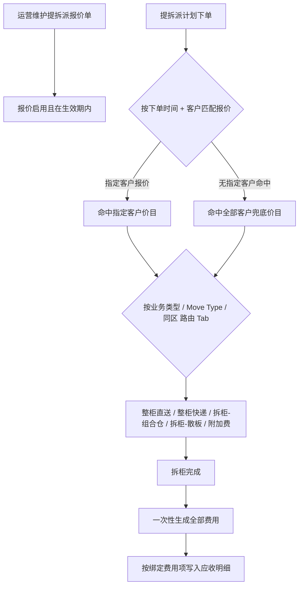
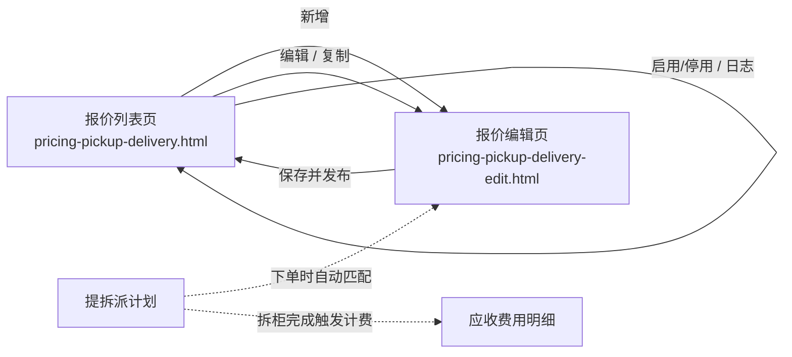

# 提拆派报价 — 产品需求文档 (PRD)

## 1. 文档说明

明确 MEEKOO 员工端「**提拆派报价**」的价目维护、客户报价匹配、价目 Tab 路由及拆柜后应收费用一次性生成逻辑。

### 1.1 修订记录

| 版本号 | 修订日期 | 修订人 | 修订说明 |
|--------|----------|--------|----------|
| V1.0 | 2026-05-21 | — | 初稿，基于原型与业务确认 |
| V1.1 | 2026-05-22 | — | 按 PRD 标准模板重组章节结构，内容无业务变更 |
| V1.2 | 2026-05-22 | — | 对齐《需求文档模板》：文档说明、4.1 产品方案概述、4.3 功能详述编号与条目结构 |
| V1.3 | 2026-05-22 | — | 第 3 章流程图改为 PNG 配图（Word 可显示为图）；Mermaid 源码移至附录 C |

### 1.2 名词解释

仅收录本模块内**非字面可懂**或**与日常用语含义不同**的术语；匹配优先级、客户范围等规则见正文第 3、4 章。

| 专有名词 | 解释/定义 |
|----------|-----------|
| 生效中 | 报价为**启用**，且当前时间 ∈ [生效时间, 失效时间]；此状态下编辑页整页只读 |
| Move Type | 提拆派计划明细字段，表示派送/渠道类型（如 FBA卡派、UPS），用于价目 Tab 路由 |
| 绑定费用项 | 各价目 Tab 在「费用项配置」中选定的应收费用项；拆柜出账时费用行按此拆分 |
| 分区 / 区 | 价目表 `region` 字段，将仓库代码归类；组合仓要求本柜涉及仓码**落在同一区** |
| 组合仓 | 拆柜后同区多 FBA 仓拼仓派送；按全包价减基础提拆价后按方数分摊 |
| 散板 | 拆柜后按板或按尾程渠道计价；组合仓因**跨区**不满足时降级走此 Tab |

---

## 2. 产品概述

### 2.1 产品背景

在 MEEKOO 员工端「应收报价配置」下，需维护**提拆派应收价目**。运营配置完成后，系统在**提拆派计划**业务场景下自动匹配报价，并在**拆柜完成**时一次性生成应收费用明细。

当前痛点包括：多客户、多产品线（直送 / 快递 / 组合仓 / 散板）价目分散难维护；出账费用项与价目对应关系不清晰；计划字段与价目 Tab 的匹配规则缺乏统一说明。

### 2.2 目标用户

| 用户角色 | 特征与诉求 |
|----------|------------|
| 运营 / 商务 | 维护客户价目、控制生效周期、复制历史报价 |
| 财务 / 应收 | 确保拆柜后费用按绑定费用项正确拆分、币种一致 |
| 系统管理员 | 配置费用项绑定、查看操作日志 |

### 2.3 产品目标

| 类型 | 目标说明 |
|------|----------|
| 定性 | 支持多客户、多产品线价目维护；匹配规则可预期（指定客户优先、按计划字段路由 Tab） |
| 定量 | 拆柜完成后一次性生成全部相关费用（提拆 + 派送/直送/快递 + 附加费），避免漏费、重复计费 |

**本期不包含：**

- 客户组维度绑定（仅具体客户）
- 生效中报价的原地改价（只读，需停用或等失效后再改）
- 客户门户价目展示（若另有模块单独立项）

### 2.4 关联模块

| 关联模块 | 与本模块关系 |
|----------|--------------|
| 提拆派计划 | 下单时按客户与时间匹配报价；拆柜完成触发价目路由与费用生成 |
| 基础数据-费用项配置 | 维护各价目 Tab 可绑定的应收费用项；出账费用行按绑定项拆分 |
| 应收出账 | 拆柜后生成的费用明细写入应收侧，供对账与结算使用 |

---

## 3. 业务流程与架构

### 3.0 图示与导出规范

- **Word / 业务阅读：** 第 3 章须以 **PNG 图片** 呈现流程图（勿仅保留 Mermaid 代码块）。
- **图片目录：** `admin/docs/images/提拆派报价/`（与 5.3 界面截图共用）；流程图命名：`05-核心业务流程.png`、`06-页面流转图.png`。
- **图源维护：** Mermaid 源码见 `admin/docs/diagrams/提拆派报价/*.mmd`；改图后运行 `python admin/docs/_render_mermaid.py` 生成 PNG，再运行 `_md_to_docx.py`。

### 3.1 核心业务流程图

*图 3.1 — 报价维护、下单匹配、Tab 路由、拆柜后一次性计费并写入应收*

**报价匹配顺序（下单时）：**

1. 下单时间 ∈ [生效时间, 失效时间] 且报价为**启用**
2. 优先匹配该客户所在的**指定客户**报价
3. 若无命中，再匹配**全部客户**报价
4. 若仍有多条命中：需在实现阶段约定二级规则（建议：指定客户报价中**最新发布**的一条）

### 3.2 页面流转图（可选）

*图 3.2 — 列表页与编辑页跳转；提拆派计划下单匹配与拆柜后计费落应收*

---

## 4. 需求详细说明

### 4.1 产品方案概述

基于功能需求清单，本模块整体方案如下：

1. **价目维护**：运营在员工端维护报价单（基础信息 + 五类价目 Tab + 附加费规则），各 Tab 绑定应收费用项，支持 CSV 导入导出。
2. **报价匹配**：提拆派计划**下单时**按时间窗、启用状态、指定客户优先于全部客户匹配唯一报价单。
3. **价目路由**：匹配后按计划的 `业务类型`、`Move Type`、仓库是否**同区**自动选择整柜直送 / 整柜快递 / 拆柜-组合仓 / 拆柜-散板 Tab（组合仓跨区降级散板）。
4. **费用出账**：**拆柜完成**时一次性生成提拆费、派送/直送/快递运费及附加费，按绑定费用项写入应收明细；缺价目时阻断并提示。

### 4.2 功能需求清单

| 模块 | 子模块 | 功能名称 | 优先级 | 功能描述简述 |
|------|--------|----------|--------|--------------|
| 报价列表 | 查询 | 条件筛选 | P0 | 按报价编号、名称、客户、生效日期范围查询 |
| 报价列表 | 维护 | 新增报价 | P0 | 进入编辑页创建新报价单 |
| 报价列表 | 维护 | 编辑报价 | P0 | 受生命周期约束；生效中仅只读 |
| 报价列表 | 维护 | 复制报价 | P1 | 从已有报价复制为新单（`?copy=`） |
| 报价列表 | 状态 | 启用/停用 | P0 | 控制是否参与匹配 |
| 报价列表 | 审计 | 操作日志 | P1 | 更多 → 日志，记录关键操作 |
| 报价编辑 | 基础信息 | 报价单头 | P0 | 名称、适用客户、生效/失效时间、结算币种 |
| 报价编辑 | 价目 Tab | 整柜直送 | P0 | 分区 + 仓库代码 + 多柜型列价格 |
| 报价编辑 | 价目 Tab | 整柜快递 | P0 | 整柜快递价目表 |
| 报价编辑 | 价目 Tab | 拆柜-组合仓 | P0 | 基础提拆价 + 派送价目（含分摊公式） |
| 报价编辑 | 价目 Tab | 拆柜-散板 | P0 | 基础提拆价 + 尾程渠道子 Tab |
| 报价编辑 | 价目 Tab | 附加费 | P0 | 触发条件 + 计费方式规则列表 |
| 报价编辑 | 配置 | 费用项绑定 | P0 | 各 Tab 绑定应收费用项 |
| 报价编辑 | 工具 | 导入/导出 | P1 | CSV 模板导入导出价目表 |
| 计费引擎 | 匹配 | 客户报价匹配 | P0 | 指定客户 > 全部客户 |
| 计费引擎 | 路由 | 价目 Tab 路由 | P0 | 按提拆派计划字段自动选 Tab |
| 计费引擎 | 出账 | 拆柜后费用生成 | P0 | 一次性生成全部相关费用 |

### 4.3 具体功能详述

*（针对清单中的每个核心功能进行详细说明）*

#### 4.3.1 【报价列表】报价列表 — 查询与维护

- **使用场景：** 运营查询、维护提拆派报价，启用/停用价目，查看历史操作。
- **前置条件：** 员工端登录；具备「应收报价配置 → 提拆派报价」菜单权限。
- **操作流程：**
  - 进入列表页 `pricing-pickup-delivery.html`
  - 输入查询条件筛选
  - 执行新增 / 编辑 / 复制 / 启用停用 / 查看日志
- **数据输入与输出：**
  - **输入：** 报价编号、报价名称、客户、生效日期范围
  - **输出：** 列表列含报价编号、名称、客户、生效/失效时间、币种、状态、创建/修改时间；客户列展示「全部客户」或已选客户名称摘要
- **业务规则（核心）：** 编辑入口受【4.3.2】生命周期约束。
- **异常处理：** 无数据时展示空状态；操作失败 Toast 提示。

#### 4.3.2 【报价单生命周期】报价单生命周期与编辑权限

- **使用场景：** 控制价目何时参与匹配、何时允许修改。
- **前置条件：** 报价单已创建。
- **操作流程：** 列表或编辑页进行启用/停用；在可编辑状态下修改后「保存并发布」。
- **数据输入与输出：**
  - **输入：** 启用/停用操作；编辑页全量字段（受只读约束）
  - **输出：** 状态展示（启用/禁用；生效中 = 启用且在生效时间内）
- **业务规则（核心）：**
  - **状态流转：** **启用**参与匹配；**禁用**不参与。**生效中**时编辑页**整页只读**，不可保存；需调整已生效价目时先**停用**或待**失效后**再编辑（**不需要强制复制**）。
  - **发布：** 与原型「保存并发布报价单」一致，保存即发布，无单独草稿态。
  - **复制：** 支持 `?copy=`；新单可编辑全部字段；报价编号、生效时间按规则重新生成。
  - **权限控制：** 按员工端菜单与角色控制可见/可操作范围。
  - **其他规则：** 操作日志记录创建、发布、停用、启用、复制来源等；字段级留痕按实现约定。

| 场景 | 列表操作 | 编辑页 |
|------|----------|--------|
| 未生效 / 已失效 / 禁用且允许维护 | 可编辑 | 可编辑并保存发布 |
| **生效中** | 可进入编辑入口 | **整页只读** |
| 需调整已生效价目 | 先停用或待失效 | 可编辑状态下直改保存发布 |

- **异常处理：** 生效中尝试保存时拦截并提示「报价生效中，不可编辑」。

#### 4.3.3 【报价编辑】报价编辑 — 基础信息

- **使用场景：** 新建或维护报价单头信息，决定匹配范围与结算币种。
- **前置条件：** 进入编辑页；非生效中只读状态（或新建）。
- **操作流程：** 填写基础信息 → 维护各价目 Tab → 绑定费用项 → 保存并发布。
- **数据输入与输出：**

| 字段 | 必填 | 说明 |
|------|------|------|
| 报价名称 | 是 | |
| 适用客户 | 是 | **所有客户**（兜底）/ **指定客户**（多选，至少 1 个）；不支持客户组 |
| 生效时间 | 是 | 精确到秒 |
| 失效时间 | 是 | 须 ≥ 生效时间 |
| 结算币种 | 是 | USD / CNY / EUR / GBP；各 Tab 价格按此币种 |

- **业务规则（核心）：**
  - **字段校验：** 失效时间 ≥ 生效时间；指定客户至少 1 个。
- **异常处理：** 校验失败字段级提示。

#### 4.3.4 【报价编辑】报价编辑 — 价目 Tab

- **使用场景：** 维护五类价目表、附加费规则及费用项绑定。
- **前置条件：** 基础数据-费用项配置已维护；建议发布前各启用路由 Tab 已绑定费用项。
- **操作流程：** 切换 Tab → 维护价目行 / 规则 → 选择绑定费用项 → 按需 CSV 导入导出 → 保存并发布。
- **数据输入与输出：**

| Tab | 主要内容 | 绑定费用项键 | 默认费用项示例 |
|-----|----------|--------------|----------------|
| 整柜直送 | 分区 + 仓库代码 + 多柜型列价格 + 备注；柜型选择；导入导出 | direct | 整柜直送运费 |
| 整柜快递 | 整柜快递价目表 | express | 整柜快递运费 |
| 拆柜-组合仓 | 基础提拆价 + 派送价目（含公式说明）；柜型列；导入导出 | unpackBase / unpackDelivery | 拆柜提拆费 / 组合仓派送费 |
| 拆柜-散板 | 基础提拆价 + 尾程渠道子 Tab（FBA / Walmart / 私卡派 / 自提 / 快递等） | looseBase / looseDelivery | 拆柜提拆费 / 散板派送费 |
| 附加费 | 规则列表（触发条件 + 计费方式） | — | 按规则类型映射 |

- **业务规则（核心）：** 费用项下拉来自基础数据-费用项配置。
- **异常处理：** CSV 导入分区/代码/价格格式错误时行级提示。

#### 4.3.5 【计费引擎】价目路由（提拆派计划 → 报价 Tab）

- **使用场景：** 提拆派计划下单或拆柜计费时，自动选择报价内对应 Tab 价目。
- **前置条件：** 已匹配到有效报价单；计划含业务类型、Move Type、仓库代码等字段。
- **操作流程：** 系统读取计划字段 → 按规则路由 Tab → 取价计费（不在报价页人工选 Tab）。
- **数据输入与输出：**
  - **输入：** 柜/计划级 `业务类型`；明细级 `Move Type`；仓库代码及分区
  - **输出：** 选中的 Tab 及对应价目行
- **业务规则（核心）：**

| 使用的报价 Tab | 条件 |
|----------------|------|
| **整柜直送** | `业务类型 = 直送` |
| **整柜快递** | `业务类型 = 拆柜` 且 `Move Type ∈ {UPS, FEDEX, DHL, USPS}` |
| **拆柜-组合仓** | `业务类型 = 拆柜` 且 `Move Type ∈ {FBA卡派, Walmart卡派}` **且** 本柜仓库代码**均在同一分区（区）** |
| **拆柜-散板** | `业务类型 = 拆柜` 且属于散板渠道（见下） |

- **组合仓 → 散板降级：** 满足组合仓 Move Type 但仓库**不在同一区**时，改走散板，不按组合仓计价。
- **散板渠道：** `业务类型 = 拆柜`，且 Move Type 含 FBA卡派、Walmart卡派、私卡派、自提、快递（散板 Tab 内「快递」子渠道，板单价模式）等。
- **未配置价目：** 对应 Tab 无有效价格行时，拆柜后费用生成**失败或告警**（阻断 + 提示「缺少 xx 价目」），避免 silent 漏费。

- **异常处理：** 缺少价目 Tab 时明确错误文案，不静默跳过。

#### 4.3.6 【计费引擎】计费规则

- **使用场景：** 拆柜完成后按路由 Tab 计算各费用行金额。
- **前置条件：** 价目路由已完成；计划含方数、重量、箱数等计费字段。
- **业务规则（核心）：**

**组合仓派送分摊：**

单票运费 = (对应分区**全包价** − **基础提拆价格**) × (单票该分区方数 / 全柜总方数)

- 全包价：价目表该分区、对应柜型列价格
- 基础提拆价格：组合仓 Tab「基础提拆价格」
- 方数：以提拆派计划/拆柜报告实测或计费方数为准

**超重（组合仓）：** 先算密度（LB ÷ m³）；若超重，分摊结果 × 超重系数 = 重量 ÷ 体积 ÷ **500**（常数 500 已定稿）。

**散板：**

| 渠道类型 | 计价方式 |
|----------|----------|
| FBA / Walmart 等 | 分区 + 仓库代码 + 单价 |
| 自提 / 快递 | 板单价（整板一口价） |
| 私卡派 | 按距离范围分组维护价格 |

**整柜直送 / 整柜快递：** 按分区 + 仓库代码 + 柜型列匹配单价；路由见 4.3.5，不混用 Tab。

#### 4.3.7 【报价编辑】附加费

- **使用场景：** 拆柜完成后与主运费一并生成附加费用。
- **前置条件：** 附加费规则已配置且启用。
- **业务规则（核心）：**
  - **规则类型：** 超出按量加收、触发后固定加收、按天计费、双项固定费、重量阶梯、超限拦截等；支持启用/停用、编辑参数。
  - **触发时点：** **拆柜完成后**，与提拆费、派送费等**一次性生成**。
  - **示例：** 超箱费；超地址费（拼仓目的地数超阈值）；提柜超重（柜型+重量阶梯，含拒绝接单、单询档）。
  - **block：** 拆柜后生成或接单链路拦截并提示。
  - **manual：** 生成待确认/单询类费用，不自动填金额。
- **异常处理：** block 场景展示拦截原因；manual 进入待确认流程。

#### 4.3.8 【计费引擎】拆柜后费用生成

- **使用场景：** 拆柜完成事件触发，写入应收费用明细。
- **前置条件：** 计划已匹配报价并完成 Tab 路由；价目与费用项齐全。
- **操作流程：** 提拆派计划下单 → 匹配报价 → 路由 Tab → 拆柜完成 → 一次性生成提拆费 + 派送/直送/快递运费 + 附加费 → 写入应收。
- **数据输入与输出：**
  - **输入：** 匹配到的报价单、计划明细（Move Type、FBA Code、方数、重量、箱数等）
  - **输出：** 按绑定费用项拆分的费用行；币种 = 报价单结算币种
- **异常处理：** 缺价目、匹配失败、block 规则等见 4.3.5、4.3.7。

#### 4.3.9 【报价编辑】校验规则

- **业务规则（核心）：**

| 校验项 | 规则 |
|--------|------|
| 生效/失效时间 | 必填；失效 ≥ 生效 |
| 指定客户 | 至少 1 个 |
| 发布 | 建议校验关键 Tab 已维护价格、费用项已绑定 |
| 导入 | 分区/代码/价格格式校验，失败提示行级错误 |

#### 4.3.10 【测试】验收标准

1. 指定客户 A 与全部客户各一张生效报价，A 下单命中指定客户报价。
2. 业务类型 = 直送的计划，仅取整柜直送价目，且费用项 = 绑定直送项。
3. 拆柜 + FBA卡派 + 同区多仓 → 组合仓价目 + 分摊公式正确。
4. 拆柜 + FBA卡派 + 跨区 → 走散板价目，不走组合仓。
5. 拆柜 + UPS → 整柜快递价目。
6. 生效中报价：编辑页只读，保存不可用；失效或停用后可直改保存，无需复制。
7. 拆柜完成：一次生成提拆、派送、附加费等全部费用行。

#### 4.3.11 【研发】待实现细节（技术方案补充）

- 多条指定客户报价同时命中时的**二级优先级**
- 「同一区」判定数据源（价目表 region 与计划 FBA Code 映射规则）
- 价目行匹配算法（多代码 `/` 分隔、重复代码优先级）

---

## 5. 界面与交互需求

### 5.1 页面布局规范

- 遵循 MEEKOO 员工端现有布局：顶栏面包屑「首页 › 应收报价配置 › 提拆派报价」、左侧导航、主内容区表格/表单。
- **列表页：** 查询区 + 工具条（新增）+ 数据表格 + 分页；操作列含编辑、复制、启用/停用、更多（日志）。
- **编辑页：** 顶部基础信息表单 + Tab 切换（5 个价目 Tab + 附加费）；各 Tab 内价目表、绑定费用项下拉、导入导出按钮。
- 原型参考：`admin/pages/pricing-pickup-delivery.html`、`admin/pages/pricing-pickup-delivery-edit.html`。

### 5.2 交互反馈

| 场景 | 交互要求 |
|------|----------|
| 保存并发布成功 | Toast 成功提示，返回列表或刷新状态 |
| 校验失败 | 字段级 / 行级错误提示（含 CSV 导入失败行号） |
| 生效中进入编辑 | 表单、表格、保存按钮**整页只读**；展示「报价生效中，不可编辑」 |
| 启用/停用 | 二次确认（建议）；操作后刷新列表状态 |
| 缺少价目 | 拆柜后生成失败时明确提示「缺少 xx 价目」 |
| 导入/导出 | 直送、组合仓派送、散板等支持 CSV 模板；需先选柜型再生成列 |
| 价目表检索 | 支持分区/仓库代码过滤 |

### 5.3 功能界面截图

截图与流程图均放在 `admin/docs/images/提拆派报价/`：界面截图 `01-`～`04-`；流程图 `05-`、`06-`（见第 3 章）。界面截图可运行 `_capture_prd_screenshots.py`，流程图可运行 `_render_mermaid.py`。在 md 中用 `` 引用，`_md_to_docx.py` 导出 docx 时会嵌入；缺失时标注「图片缺失」。

#### 5.3.1 报价列表页

*图 5.3.1 — 查询区、报价表格、操作列（编辑 / 复制 / 启用停用 / 日志）*

#### 5.3.2 报价编辑页 — 基础信息

*图 5.3.2 — 报价名称、适用客户、生效/失效时间、结算币种*

#### 5.3.3 报价编辑页 — 价目 Tab（示例）

*图 5.3.3 — 任选一价目 Tab（如拆柜-组合仓）展示价目表与费用项绑定*

#### 5.3.4 关键状态与提示（可选）

*图 5.3.4 — 如：生效中整页只读、保存成功 Toast、缺少价目报错等*

---

## 6. 非功能性需求

### 6.1 性能需求

- 列表页查询响应时间建议 ≤ 2 秒（常规数据量）。
- 价目表导入：单次建议上限与行级校验策略在技术方案中约定（如 ≤ 5000 行）。
- 拆柜后费用生成：单柜计划在可接受时间内完成（具体 SLA 由后端评估）。

### 6.2 安全需求

- 菜单与操作按员工端角色权限控制（可见/可编辑/可启用停用）。
- 报价变更通过操作日志留痕。
- 接口层校验客户数据归属，防止越权修改他人客户报价。

### 6.3 兼容性需求

- 浏览器：Chrome、Edge 最新两个大版本（员工端标准）。
- 最低分辨率：1280×720；表格横向滚动适配宽价目表。
- 本期为 PC 员工端，不含 PDA。

---

## 7. 数据统计与埋点需求

### 7.1 业务数据监控

| 指标 | 说明 |
|------|------|
| 生效报价数量 | 按客户 / 产品线统计当前生效价目数 |
| 匹配失败次数 | 下单或拆柜时无可用报价、缺少价目 Tab 的次数 |
| 费用生成异常 | block / manual 附加费触发次数 |
| 报价变更频次 | 启用、停用、发布、复制操作统计（可取自操作日志） |

### 7.2 埋点需求清单（可选）

| 事件 | 说明 |
|------|----------|
| 报价列表_新增点击 | 进入新建流程 |
| 报价编辑_保存并发布 | 发布成功/失败 |
| 报价列表_启用停用 | 状态变更 |
| 价目导入_成功/失败 | 导入结果与行数 |

---

## 8. 上线与运维计划

- **数据初始化：** 上线前在「基础数据-费用项配置」中维护好绑定费用项；按需从旧系统导入价目 CSV。
- **培训与支持：** 对运营说明：生效中不可改价、指定客户优先、组合仓/散板同区判定；提供 CSV 导入模板与示例报价。
- **回滚策略：** 新版本报价异常时，可停用新报价并启用旧报价单恢复匹配。

---

## 附录 A：价目路由速查表

| 业务类型 | Move Type | 同区 | 报价 Tab |
|----------|-----------|------|----------|
| 直送 | — | — | 整柜直送 |
| 拆柜 | UPS / FEDEX / DHL / USPS | — | 整柜快递 |
| 拆柜 | FBA卡派 / Walmart卡派 | 是 | 拆柜-组合仓 |
| 拆柜 | FBA卡派 / Walmart卡派 | 否 | 拆柜-散板（降级） |
| 拆柜 | 私卡派 / 自提 / 快递等 | — | 拆柜-散板 |

## 附录 B：费用项绑定速查表

| 绑定键 | 默认费用项示例 | 说明 |
|--------|----------------|------|
| direct | 整柜直送运费 | 直送价目表 |
| express | 整柜快递运费 | 快递价目表 |
| unpackBase | 拆柜提拆费 | 组合仓基础提拆价 |
| unpackDelivery | 组合仓派送费 | 组合仓派送价目 |
| looseBase | 拆柜提拆费 | 散板基础提拆价 |
| looseDelivery | 散板派送费 | 散板各渠道派送 |

## 附录 C：流程图源码（Mermaid，维护用）

> 对外 Word 以第 3 章 PNG 为准；改流程后请更新下方源码并重新运行 `_render_mermaid.py`。

**05-核心业务流程**（`diagrams/提拆派报价/05-核心业务流程.mmd`）：

**06-页面流转图**（`diagrams/提拆派报价/06-页面流转图.mmd`）：

