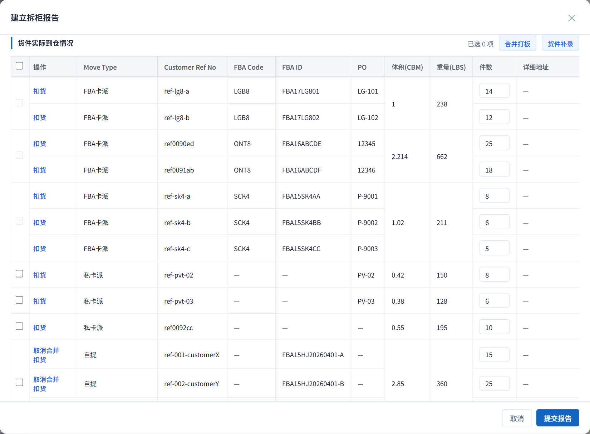
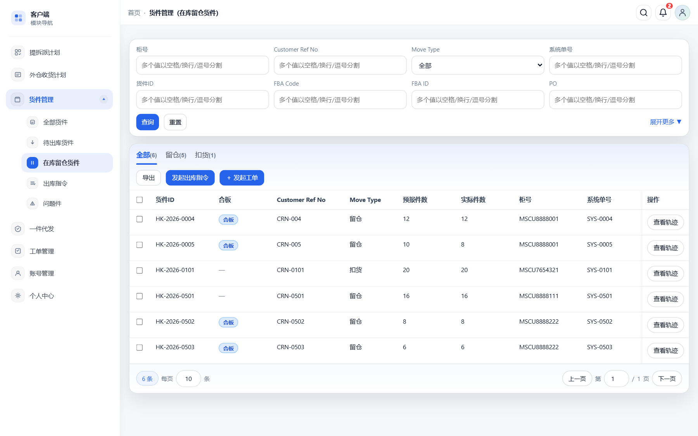
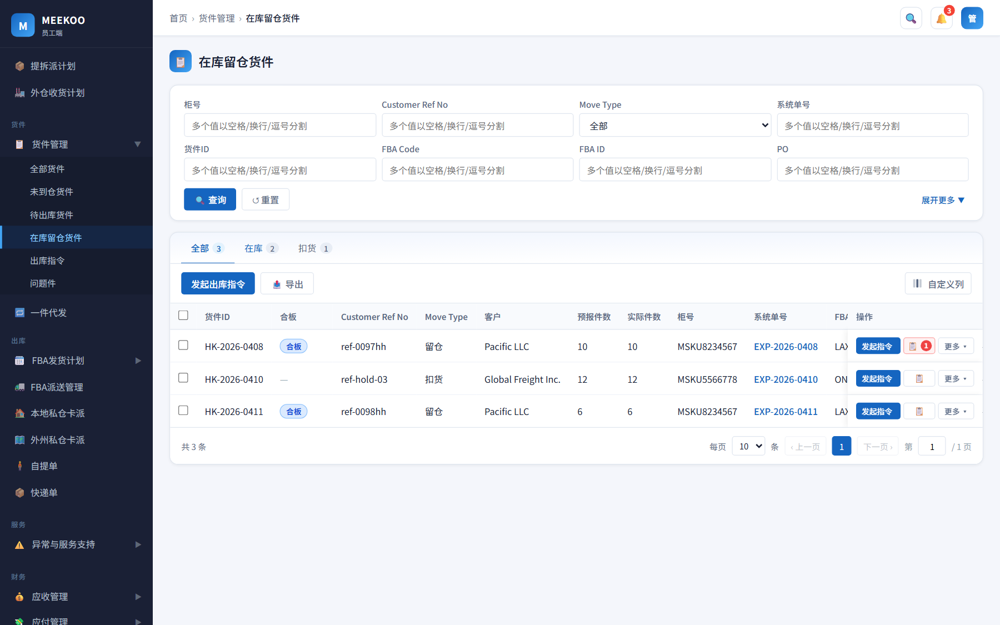
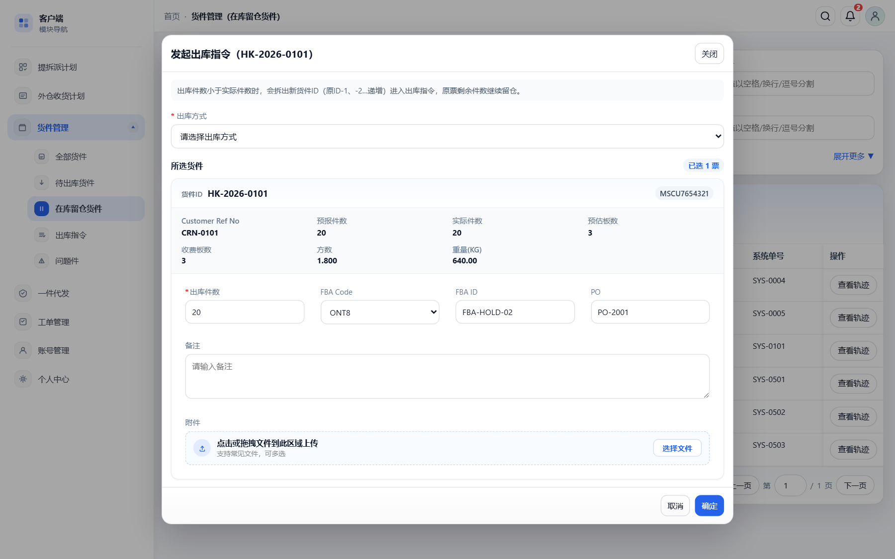
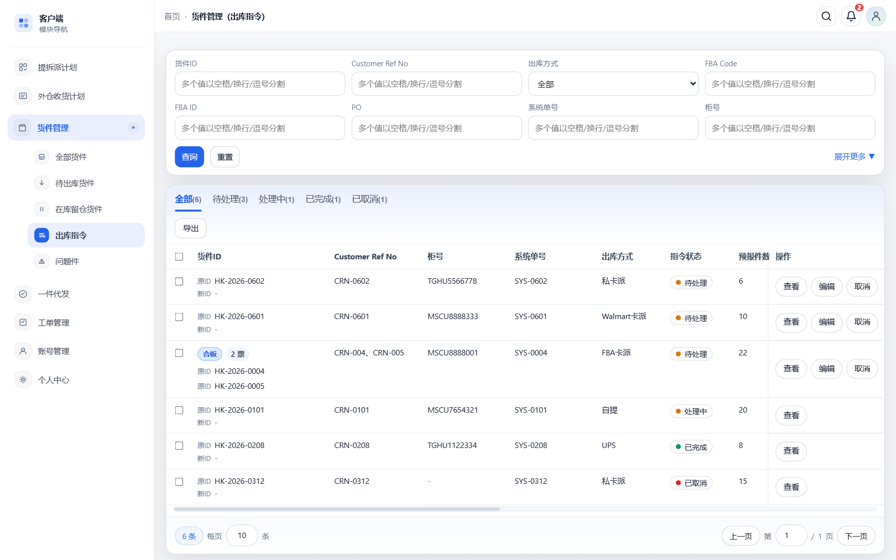
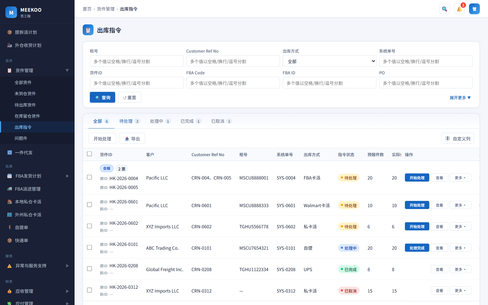
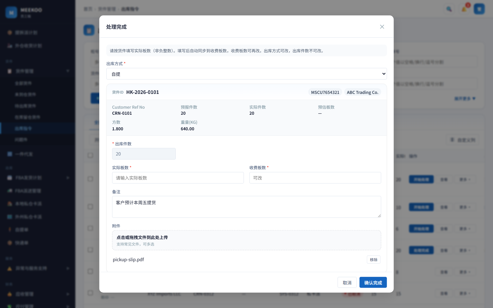

# 留仓 & 扣货出库流程

**主路径：** 拆柜合板 → 在库留仓货件发起出库指令 → 仓库执行 → 完成 → 进对应派送页

> Move Type（留仓/扣货，货件属性）≠ 出库方式（指令上的派送方式），勿混用。

## 一、拆柜报告（员工端 · 提拆派）

### 合板

私卡派 / 留仓 / 自提 / 扣货可**同类型**合板，**禁止跨 Move Type**。  
从 FBA 合组拆出改成的扣货，也可与其它扣货勾选后合板。  
合板后下游「在库留仓货件」显示合板标识。

### 件数与实际件数

| | 件数 | 实际件数 |
|--|------|----------|
| 维度 | 按货件维度填写 | 按合组（仓库清点总件数，合组只填一格；未填默认=组内各票件数之和） |
| 用途 | 下游货件件数（仓库不按票清点，但仍需按票落数） | 合组清点结果 |

提交后：

- 各票 **件数** → 该货件实际件数；下游出库件数不得超过该值。
- 合组 **实际件数** → 合组清点总数。

### 扣货

- **改为扣货**：从原合组拆出，可再与其它扣货合板。
- **问题件**：不因扣货自动勾选；由操作人自行勾选/取消；取消扣货不清问题件。

修改报告时：不再改合板结构或扣货拆并；**问题件标记只读**（均以建立时为准）。

**原型示意（建立拆柜报告 · 「件数」按票可编辑）**

## 二、发起出库（客户端 / 员工端 · 在库留仓货件）

页面改名：**在库留仓货件**。只展示**在库**的留仓、扣货；件数出完的票离开本页。可发起出库指令。

员工端额外：可代客户发起（来源=仓库发起），一次只能代**同一客户**。

**原型示意**

### 发起出库 — 字段

公共（所有出库方式）：

| 字段 | 规则 |
|------|------|
| 出库方式 | 必填；默认空（「请选择出库方式」） |
| 出库件数 | 必填（正整数，≤ 该票在库实际件数；整组不拆板时固定为在库件数，不可修改） |
| 备注 | 选填 |
| 附件 | 选填；支持常见文件，可多选（暂不限制格式/大小） |

按出库方式额外字段（切换方式时显隐）：

| 出库方式 | 字段 |
|----------|------|
| FBA卡派 / Walmart卡派 | **必填**：FBA Code、FBA ID、PO；**不展示** Address 等私卡地址区 |
| 私卡派 | **必填**：Address；**选填**：城市、州、邮编、公司名称、联系人、手机、邮箱、中文品名、英文品名；**不展示** FBA Code / FBA ID / PO 输入（指令侧保留货件原 FBA 信息，不从表单改） |
| 自提 / UPS / Fedex / DHL / USPS / 一件代发 | **选填**：FBA Code、FBA ID、PO；**不展示** 私卡地址区 |

### 合板组怎么出

勾选含合板货件时，须先选：**整组不拆板** 或 **拆板出库**。

其它发起约束：

- **合板票与独立票不可同一次发起**（客户端 / 员工端均禁止），须分开发起。
- **多张独立票**可一次勾选发起，生成**一条出库指令含多行**；每票字段分别填写与校验。

**整组不拆板**

- 选「整组不拆板」时，系统**自动勾选**同组合板组内全部在库票后再进入表单。
- 同组货件全部带出；各票出库件数固定为在库件数，不可修改。
- **出库信息整组共用一份**（按出库方式所需的 FBA 或 Address 等、备注、附件只填一次，写入该指令全部货件行）。
- **保留合板**；**货件 ID 不变**（不生成新货件 ID）。
- 生成一条出库指令（可含多票），后续查看 / 编辑 / 取消均按**整组指令**处理。
- **一次只能出一个合板组**：勾选了两个及以上合板组时，不能选「整组不拆板」，须拆板，或分次、每组单独发起。

**拆板 / 部分出**

- 出库件数可小于在库实际件数。
- **拆出部分生成新货件 ID**：规则为 `原货件ID-序号`（如 `HK-xxx-1`）；同一原票多次部分出时序号**递增**（`-1`、`-2`…）；全量出库则货件 ID 不变。
- 出库侧可见原货件 ID / 新货件 ID；剩余件数仍留在「在库留仓货件」，可再发。
- **拆板出库的指令行不再带合板标识**；在库余票保留合板，组内不足 2 票时取消合板标识。
- 件数全部出完 → 该票离开本页；未出完 → 扣减在库实际件数。

发起成功 → 出库指令进入 **待处理**。

## 三、出库指令

客户端只看进度，不做「开始处理 / 处理完成」。员工端负责执行与完成（操作顺序：主操作 → 查看 → 更多）。

| 状态 | 客户端 | 员工端 |
|------|--------|--------|
| 待处理 | 可编辑（**出库方式可改，件数不可改**）、可取消 | **开始处理**；可编辑/取消 |
| 处理中 | 只看 | **处理完成**（见下）；可取消；**无单独「编辑」** |
| 已完成 | 只看 | 按出库方式应进入对应派送页（本期原型不做入口） |
| 已取消 | 只看 | 件数加回在库留仓货件 |

**原型示意**

**处理完成**

- 出库方式可改；件数不可改；目的地类字段（FBA 或 Address 等）、备注、附件可随方式修改，校验同发起。
- **整组不拆板（合板整组指令）**：**无需填写实际板数 / 收费板数**。
- **非整组不拆板**（含单票、多独立票、拆板多票）：**按货件（票）各填**实际板数、收费板数（均为非负整数）。
- 填写实际板数后**自动同步到收费板数**；**收费板数可再改**。
- 合板整组指令编辑 / 完成时，出库信息仍整组共用。

补充：

- 待处理编辑：要改件数须取消指令后，回在库留仓货件重发；合板整组指令编辑时保留合板，不拆组、不改货件 ID。
- 取消后：件数加回在库留仓货件；若曾拆票，加回原票；合板整组取消时同指令全部行一并取消。

### 完成后去向

| 出库方式 | 去向 |
|----------|------|
| FBA卡派 / Walmart卡派 | FBA 派送 / 装车相关页 |
| 私卡派 | 本地/外州私仓发货 |
| 自提 | 自提管理 |
| UPS / Fedex / DHL / USPS | 快递相关页 |
| 一件代发 | 一件代发相关页 |

## 四、货件管理

在库的留仓 / 扣货：**不允许改 Move Type**（含改派送方式）。只能走「出库指令」出库。
